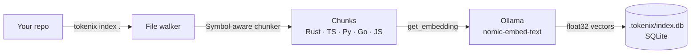
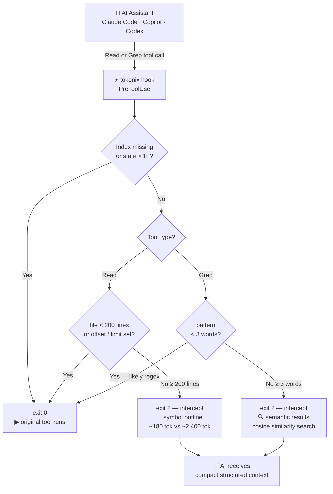

<div align="center">
  

  <h1>tokenix</h1>

  <p><strong>Stop wasting tokens. Give your AI assistant a brain.</strong></p>

  <p>
    <a href="https://github.com/juninmd/tokenix/releases"></a>
    <a href="https://crates.io/crates/tokenix"></a>
    <a href="https://github.com/juninmd/tokenix/blob/main/LICENSE"></a>
    <a href="https://www.rust-lang.org/"></a>
    
    
  </p>

  <p>
    <a href="#-quick-install">Install</a> ·
    <a href="#-how-it-works">How it Works</a> ·
    <a href="#-benchmark">Benchmark</a> ·
    <a href="#-usage">Usage</a> ·
    <a href="#-setup-by-tool">Setup</a> ·
    <a href="CONTRIBUTING.md">Contributing</a>
  </p>
</div>

---

> **tokenix** is a Rust CLI that builds a local semantic index of your codebase and intercepts AI assistant file reads — replacing 800-line file dumps with compact, structured outlines. Works with Claude Code, GitHub Copilot, and OpenAI Codex CLI.

```
Without tokenix:  Read(src/auth/middleware.rs) → 800 lines → ~2,400 tokens  ❌
With tokenix:     tokenix read src/auth/middleware.rs → symbol outline → ~180 tokens  ✅
```

Actual savings depend on codebase size, AI behavior, and file sizes. Run `tokenix gain --history` to see your real numbers.

---

## ⚡ Quick Install

### Pre-built binary (recommended)

Download the latest binary for your platform from [GitHub Releases](https://github.com/juninmd/tokenix/releases):

| Platform | File |
|---|---|
| Linux x86_64 | `tokenix-linux-x86_64` |
| Linux arm64 | `tokenix-linux-aarch64` |
| macOS x86_64 | `tokenix-macos-x86_64` |
| macOS arm64 (M1/M2/M3) | `tokenix-macos-aarch64` |
| Windows x86_64 | `tokenix-windows-x86_64.exe` |

### From crates.io

```bash
cargo install tokenix
```

### From source

```bash
git clone https://github.com/juninmd/tokenix
cd tokenix
cargo install --path .
```

> **Requirements:** [Rust](https://www.rust-lang.org/tools/install) `>= 1.75` · [Ollama](https://ollama.com/download) running locally

```bash
ollama pull nomic-embed-text   # one-time model download
```

---

## ✨ Features

| Feature | Description |
|---|---|
| **Semantic search** | Find relevant code by meaning, not just keywords |
| **Symbol-aware chunking** | Heuristic parsers for Rust, Python, TypeScript, JavaScript, Go |
| **Smart file reader** | Outlines large files; supports `--symbol` and `--lines` reads |
| **Hook-based interception** | `PreToolUse` intercepts large reads; `PostToolUse` compresses Bash/ListDirectory output |
| **Output compression** | Strips ANSI codes, emojis, blank lines, groups repeated lines, compacts JSON |
| **Graceful fallback** | Always exits `0` on errors — your AI session is never broken |
| **Token budget** | Results fit within a configurable token budget (default `3000`) |
| **Savings analytics** | `tokenix gain` shows real estimated savings from hook events |
| **Local-first** | SQLite + local Ollama embeddings — no data leaves your machine |

---

## 🔌 Supported AI Tools

| Tool | Integration |
|---|---|
| [Claude Code](https://docs.anthropic.com/en/docs/claude-code) | `PreToolUse` + `PostToolUse` hooks in `~/.claude/settings.json` |
| [GitHub Copilot](https://docs.github.com/en/copilot) | `.github/copilot-instructions.md` + `.github/hooks/hooks.json` |
| [OpenAI Codex CLI](https://help.openai.com/en/articles/11096431-openai-codex-cli-getting-started) | Shell helpers + `~/.codex/instructions.md` |

---

## 🚀 How It Works

### Indexing pipeline



### Hook interception flow



1. **`tokenix index .`** — walks your repo, chunks files, generates embeddings via Ollama, stores in `.tokenix/index.db`
2. **`tokenix query "..."`** — embeds your query and returns the most relevant chunks within a token budget
3. **`tokenix read FILE`** — returns a symbol outline for large files, full content for small ones
4. **`tokenix install-hook`** — configures your AI tool to use tokenix automatically

---

## 📊 Benchmark

> Every number below comes from a **live run** on the tokenix source — no mock data.

### Token reduction by file

| File | Lines | Without tokenix | With tokenix | Saved |
|---|---|---|---|---|
| `src/main.rs` | 723 | 5,412 tok | 412 tok | **92.4%** |
| `src/chunker.rs` | 578 | 4,292 tok | 245 tok | **94.3%** |
| `src/hook.rs` | 332 | 2,472 tok | 274 tok | **88.9%** |
| `src/store.rs` | 297 | 2,192 tok | 512 tok | **76.6%** |
| `samples/api_handler.go` | 322 | 2,266 tok | 649 tok | **71.4%** |
| `samples/auth_middleware.py` | 284 | 2,385 tok | 643 tok | **73.0%** |
| `samples/database_client.ts` | 358 | 2,805 tok | 332 tok | **88.2%** |
| `samples/user_service.rs` | 377 | 3,135 tok | 235 tok | **92.5%** |
| **TOTAL** | | **24,959 tok** | **3,302 tok** | **86.8%** |

### Cost at scale — Claude Sonnet 4.6 ($3.00 / M input tokens)

| Scenario | Tokens saved | Cost saved |
|---|---|---|
| 8 file reads (benchmark above) | 21,657 | $0.065 |
| 100 reads / session | ~270,000 | **$0.81** |
| 200 reads / day | ~540,000 | **$1.62** |
| 22 working days / month | ~11.9 M | **$35.64 / dev** |
| Team of 5 | — | **~$178 / month** |

### Reproduce it

```bash
# Linux / macOS
bash benchmark/bench.sh

# Windows
.\benchmark\bench.ps1
```

---

## 🛠 Usage

### 1. Index your repository

```bash
cd my-project
tokenix index .
```

```
tokenix indexing /home/user/my-project
  [1/42] src/main.rs
  [2/42] src/auth/middleware.rs
  ...
Done in 38.2s  ·  42 files  ·  318 chunks  ·  87,412 tokens stored
```

### 2. Semantic search

```bash
tokenix query "how does JWT validation work"
tokenix query "database connection pooling" --budget 2000
```

### 3. Smart file reader

```bash
tokenix read src/auth/middleware.rs                     # symbol outline
tokenix read src/auth/middleware.rs --symbol validate_token   # targeted
tokenix read src/auth/middleware.rs --lines 45-80       # line range
```

### 4. Token savings analytics

```bash
tokenix gain
tokenix gain --history
```

```
tokenix gain -- /home/user/my-project

  Total hook calls   47
  Intercepted        31  (66%)
  Passed through     16
  Tokens saved       84,210
  Tokens used         9,340
  Reduction          90.0%
  Cost saved (est.)  $0.2526
```

---

## 🔧 Setup by Tool

### Claude Code

```bash
tokenix install-hook --tool claude-code
```

Writes a `PreToolUse` hook to `~/.claude/settings.json` (or `.claude/settings.json` with `--local`). Large reads and semantic greps are intercepted automatically — no changes to your prompts needed.

### GitHub Copilot

```bash
cd my-project
tokenix install-hook --tool copilot
git add .github/
git commit -m "chore: add tokenix context instructions"
```

Creates `.github/copilot-instructions.md` and `.github/hooks/hooks.json`.

### OpenAI Codex CLI

```bash
tokenix install-hook --tool codex
# bash / zsh
echo 'source ~/.codex/tokenix-init.sh' >> ~/.bashrc
# PowerShell
echo '. ~/.codex/tokenix-init.ps1' >> $PROFILE
```

Then use `tx-read` and `tx-query` as shell helpers.

### All tools at once

```bash
tokenix install-hook --tool all
```

---

## 📖 Commands Reference

| Command | Description |
|---|---|
| `tokenix index [PATH]` | Index the repo at PATH (default `.`) |
| `tokenix query TEXT` | Semantic search over indexed chunks |
| `tokenix read FILE` | Smart reader — outline for large files, full for small |
| `tokenix gain` | Estimated token savings analytics |
| `tokenix stats` | Index statistics |
| `tokenix install-hook` | Install assistant hook/instructions (default `--tool all`) |
| `tokenix remove-hook` | Remove assistant hook/instructions (default `--tool all`) |
| `tokenix hook` | `PreToolUse` handler — intercepts large reads (called by AI tools) |
| `tokenix hook-post` | `PostToolUse` handler — compresses Bash/ListDirectory output (called by AI tools) |

<details>
<summary>Flag reference</summary>

**`tokenix index`**

| Flag | Default | Description |
|---|---|---|
| `--model`, `-m` | `nomic-embed-text` | Ollama embedding model |
| `--force`, `-f` | false | Reindex all files, ignoring cache |

**`tokenix query`**

| Flag | Default | Description |
|---|---|---|
| `--budget`, `-b` | 3000 | Max approximate tokens to return |
| `--k` | 20 | Candidate chunks before budget filtering |
| `--file`, `-f` | — | Filter results to a specific file |
| `--model`, `-m` | `nomic-embed-text` | Ollama embedding model |
| `--path`, `-p` | `.` | Repository/index path |

**`tokenix install-hook` / `tokenix remove-hook`**

| Flag | Values | Description |
|---|---|---|
| `--tool` | `claude-code`, `copilot`, `codex`, `all` | Target tool (default `all`) |
| `--local` | — | Claude Code: use `.claude/settings.json` instead of global |

</details>

---

## 🧠 Supported Languages

| Language | Extensions | Symbol types |
|---|---|---|
| Rust | `.rs` | `fn`, `struct`, `enum`, `impl`, `trait`, `mod` |
| Python | `.py` | `def`, `async def`, `class` |
| TypeScript | `.ts`, `.tsx` | `function`, `class`, `interface`, `type`, arrow functions |
| JavaScript | `.js`, `.jsx`, `.mjs`, `.cjs` | `function`, `class`, arrow functions |
| Go | `.go` | `func`, `type` |
| Generic | `.java`, `.c`, `.cpp`, `.cs`, `.rb`, `.swift`, `.kt`, `.toml`, `.yaml`, `.json`, `.md`, … | 400-token line blocks |

---

## 🏗 Architecture

```
src/
├── main.rs       CLI entry (clap), command dispatch, install helpers
├── chunker.rs    Symbol-aware heuristic chunking + outline generation
├── embed.rs      Ollama HTTP client: get_embedding(), check_ollama()
├── store.rs      SQLite schema, CRUD, cosine similarity, hook log NDJSON
├── indexer.rs    File walker + incremental index pipeline
├── query.rs      Ranking, token-budget selection, result formatting
├── hook.rs       Hook handler for Claude-style and Copilot-style JSON input
└── gain.rs       Analytics from .tokenix/hook.log
```

Storage lives at `.tokenix/index.db`. Embeddings are stored as raw `float32` blobs. Cosine similarity is computed in Rust — no external vector database needed.

---

## 🤝 Contributing

Contributions are welcome! See [CONTRIBUTING.md](CONTRIBUTING.md) for how to get started.

---

## 📄 License

[MIT](LICENSE)

<!-- GitHub Topics: rust cli llm token-optimization semantic-search embeddings ollama claude-code copilot ai-tools code-assistant developer-tools -->
