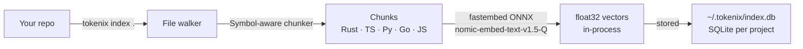
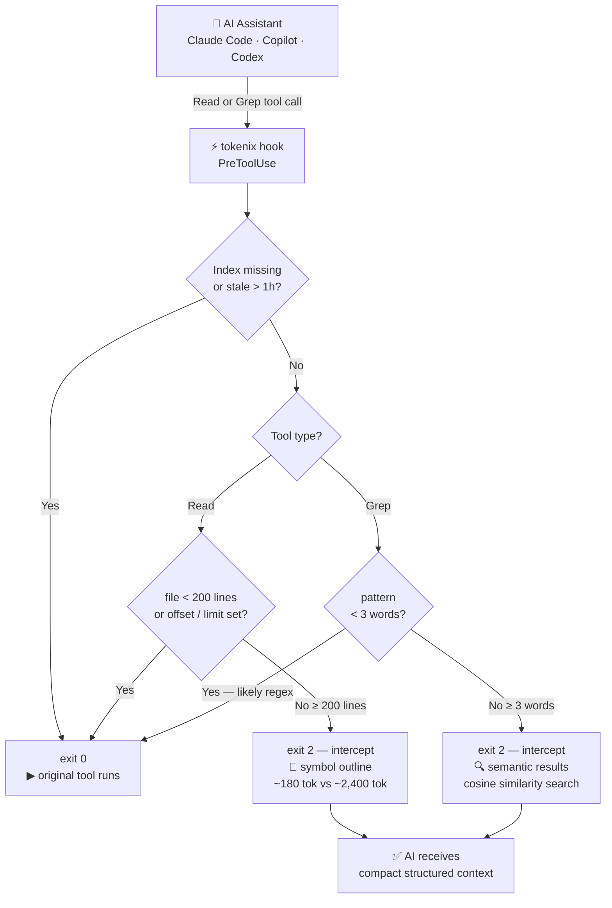

<div align="center">
  

  <h1>tokenix</h1>

  <p><strong>Stop wasting tokens. Give your AI assistant a brain.</strong></p>

  <p>
    <a href="https://github.com/juninmd/tokenix/releases"></a>
    <a href="https://crates.io/crates/tokenix"></a>
    <a href="https://github.com/juninmd/tokenix/blob/main/LICENSE"></a>
    <a href="https://www.rust-lang.org/"></a>
    
    
    
  </p>

  <p>
    <a href="#-quick-install">Install</a> ·
    <a href="#-how-it-works">How it Works</a> ·
    <a href="#-benchmark">Benchmark</a> ·
    <a href="#-usage">Usage</a> ·
    <a href="#-setup-by-tool">Setup</a> ·
    <a href="CONTRIBUTING.md">Contributing</a>
  </p>
</div>

---

> **tokenix** is a Rust CLI that builds a local semantic index of your codebase and intercepts AI assistant file reads — replacing 800-line file dumps with compact, structured outlines. Works with Claude Code, GitHub Copilot, and OpenAI Codex CLI. **No Ollama or external server required.**

```
Without tokenix:  Read(src/auth/middleware.rs) → 800 lines → ~2,400 tokens  ❌
With tokenix:     tokenix read src/auth/middleware.rs → symbol outline → ~180 tokens  ✅
```

Actual savings depend on codebase size, AI behavior, and file sizes. Run `tokenix gain --history` to see your real numbers.

---

## ⚡ Quick Install

### Pre-built binary (recommended)

Download the latest binary for your platform from [GitHub Releases](https://github.com/juninmd/tokenix/releases):

| Platform | File |
|---|---|
| Linux x86_64 | `tokenix-linux-x86_64` |
| Linux arm64 | `tokenix-linux-aarch64` |
| macOS x86_64 | `tokenix-macos-x86_64` |
| macOS arm64 (M1/M2/M3) | `tokenix-macos-aarch64` |
| Windows x86_64 | `tokenix-windows-x86_64.exe` |

### From crates.io

```bash
cargo install tokenix
```

### From source

```bash
git clone https://github.com/juninmd/tokenix
cd tokenix
cargo install --path .
```

> **Requirements:** [Rust](https://www.rust-lang.org/tools/install) `>= 1.75` — that's all. No Ollama, no Python, no external services.

The embedding model (`nomic-embed-text-v1.5-Q`, ~130 MB) is downloaded automatically on first use and cached locally.

---

## ✨ Features

| Feature | Description |
|---|---|
| **Semantic search** | Find relevant code by meaning, not just keywords |
| **Symbol-aware chunking** | Heuristic parsers for Rust, Python, TypeScript, JavaScript, Go |
| **Smart file reader** | Outlines large files; supports `--symbol` and `--lines` reads |
| **Hook-based interception** | `PreToolUse` intercepts large reads; `PostToolUse` compresses Bash/ListDirectory output |
| **Output compression** | Strips ANSI codes, emojis, blank lines, groups repeated lines, compacts JSON |
| **In-memory daemon** | `tokenix serve` keeps model + index in RAM — warm Grep calls drop from ~430ms to ~80ms |
| **Graceful fallback** | Always exits `0` on errors — your AI session is never broken |
| **Token budget** | Results fit within a configurable token budget (default `3000`) |
| **Savings analytics** | `tokenix gain` — token summary, cost table across 20 models (Anthropic, OpenAI, Google), by-tool breakdown |
| **Bundled output filters** | 59 RTK-compatible TOML filters embedded in the binary — auto-applied to Bash output for `uv`, `cargo`, `gradle`, `terraform`, and more. Generate new ones with `tokenix filter generate` |
| **Custom filters** | Drop `.toml` files in `~/.tokenix/filters/` — they override bundled filters. AI-assisted generation via `tokenix filter generate <command>` |
| **Local-first, no dependencies** | fastembed ONNX in-process — no Ollama, no server, no internet after first run |

---

## 🔌 Supported AI Tools

| Tool | Integration |
|---|---|
| [Claude Code](https://docs.anthropic.com/en/docs/claude-code) | `PreToolUse` + `PostToolUse` hooks in `~/.claude/settings.json` |
| [GitHub Copilot](https://docs.github.com/en/copilot) | `.github/copilot-instructions.md` + `.github/hooks/hooks.json` |
| [OpenAI Codex CLI](https://help.openai.com/en/articles/11096431-openai-codex-cli-getting-started) | Shell helpers + `~/.codex/instructions.md` |

---

## 🚀 How It Works

### Indexing pipeline



### Hook interception flow



1. **`tokenix index .`** — walks your repo, chunks files, generates embeddings via fastembed (ONNX, in-process), stores in `~/.tokenix/<project>.db`
2. **`tokenix query "..."`** — embeds your query and returns the most relevant chunks within a token budget
3. **`tokenix read FILE`** — returns a symbol outline for large files, full content for small ones
4. **`tokenix install-hook`** — configures your AI tool to use tokenix automatically

---

## 📊 Benchmark

> Every number below comes from a live benchmark run on the tokenix source, using the actual index, chunking, and query code paths.

### Methodology

`tokenix benchmark` runs a reproducible benchmark against the current checkout. It uses the production code paths: `indexer::index_repo`, `chunker::generate_outline`, targeted symbol chunking, and semantic `query_index`.

It measures three things:

1. **Gross read savings** - full file tokens vs. large-file outline tokens.
2. **Net targeted workflow savings** - full file tokens vs. outline + the target symbol chunk the assistant would read next.
3. **Semantic search quality** - labeled queries with expected files, reported as Hit@1 and Hit@3.

Example live run on this repository:

| Metric | Result |
|---|---:|
| Large-file read reduction | **89.0%** saved |
| Targeted outline + symbol workflows | **72.1%** saved |
| Target symbols resolved | **6 / 6** |
| Semantic search Hit@1 | **4 / 7** |
| Semantic search Hit@3 | **7 / 7** |

The targeted workflow metric is the important one: it discounts the common follow-up read after an outline, so it is a closer estimate of real session savings than outline-only reduction.

### Reproduce it

```bash
tokenix benchmark --refresh-index

# Linux / macOS
bash benchmark/bench.sh

# Windows
.\benchmark\bench.ps1
```

---

## 🛠 Usage

### 1. Index your repository

```bash
cd my-project
tokenix index .
```

```
tokenix indexing /home/user/my-project
  discovered 42 file(s) — chunking
  embedding 318 chunks via fastembed (ONNX)...
Done in 42.3s  ·  42 files indexed  ·  318 chunks  ·  87,412 tokens stored
```

> **First run:** the model (~130 MB) is downloaded automatically. Subsequent runs use the local cache.

### 2. Semantic search

```bash
tokenix query "how does JWT validation work"
tokenix query "database connection pooling" --budget 2000
```

### 3. Smart file reader

```bash
tokenix read src/auth/middleware.rs                     # symbol outline
tokenix read src/auth/middleware.rs --symbol validate_token   # targeted
tokenix read src/auth/middleware.rs --lines 45-80       # line range
```

### 4. Token savings analytics

```bash
tokenix gain
tokenix gain --history   # includes last 20 hook events
```

```
╭────────────────────────────────────────────────────────────────╮
│ tokenix gain  ·  my-project                                   │
╰────────────────────────────────────────────────────────────────╯

  TOKEN SUMMARY                              HOOK CALLS
  Original (would-be)               332,068    Total                       349
  After optimization                214,646    Intercepted            148  (42%)
  Saved                             240,091    Passed through              201
  Reduction                  72.3%  [█████████████░░░░░]

  COST ESTIMATE  (input tokens · USD)
    Prices per 1M input tokens from public provider pricing pages. Collected: 2026-05-07.

      Model                          $/1M in       Without          With         Saved
      ───────────────────────────  ─────────  ────────────  ────────────  ────────────
      claude-haiku-4-5                 $1.00       $0.3321       $0.2146       $0.1174
      claude-sonnet-4.6 ★              $3.00       $0.9962       $0.6439       $0.3523
      claude-opus-4.7                  $5.00       $1.6603       $1.0732       $0.5871
      gpt-5.4-mini                     $0.75       $0.2491       $0.1610       $0.0881
      gpt-5.4                          $2.50       $0.8302       $0.5366       $0.2936
      gemini-3.1-flash-preview         $0.25       $0.0830       $0.0537       $0.0294
      gemini-3.1-pro-preview           $2.00       $0.6641       $0.4293       $0.2348
      ★ reference model · prices collected 2026-05-07

  BY TOOL
  Read    59 calls   228,974 ▓▓▓▓▓▓▓▓▓▓▓▓▓▓▓▓▓▓▓░
  Grep    87 calls    11,094 ▓░░░░░░░░░░░░░░░░░░░
  Bash     2 calls        23 ░░░░░░░░░░░░░░░░░░░░
```

The cost table includes 20 models across Anthropic, OpenAI, and Google — prices updated May 2026.

---

## 🔧 Setup by Tool

### Claude Code

```bash
tokenix install-hook --tool claude-code
```

Writes a `PreToolUse` hook to `~/.claude/settings.json` (or `.claude/settings.json` with `--local`). Large reads and semantic greps are intercepted automatically — no changes to your prompts needed.

### GitHub Copilot

```bash
cd my-project
tokenix install-hook --tool copilot
git add .github/
git commit -m "chore: add tokenix context instructions"
```

Creates `.github/copilot-instructions.md` and `.github/hooks/hooks.json`.

### OpenAI Codex CLI

```bash
tokenix install-hook --tool codex
# bash / zsh
echo 'source ~/.codex/tokenix-init.sh' >> ~/.bashrc
# PowerShell
echo '. ~/.codex/tokenix-init.ps1' >> $PROFILE
```

Then use `tx-read` and `tx-query` as shell helpers.

### All tools at once

```bash
tokenix install-hook --tool all
```

---

## 📖 Commands Reference

| Command | Description |
|---|---|
| `tokenix index [PATH]` | Index the repo at PATH (default `.`) |
| `tokenix query TEXT` | Semantic search over indexed chunks |
| `tokenix read FILE` | Smart reader — outline for large files, full for small |
| `tokenix gain` | Token savings analytics with per-model cost table |
| `tokenix gain --history` | Same, plus last 20 hook events |
| `tokenix benchmark` | Reproducible savings and semantic-quality benchmark |
| `tokenix stats` | Index statistics (files, chunks, tokens, age) |
| `tokenix serve [--port N]` | Start background embedding daemon (keeps model + index in RAM) |
| `tokenix stop` | Stop the background daemon |
| `tokenix filter list` | Show top Bash commands by tokens wasted (no filter yet) |
| `tokenix filter generate [CMD]` | AI-generate a TOML output filter for a command |
| `tokenix install-hook` | Install assistant hook/instructions (default `--tool all`) |
| `tokenix remove-hook` | Remove assistant hook/instructions (default `--tool all`) |
| `tokenix hook` | `PreToolUse` handler — intercepts large reads (called by AI tools) |
| `tokenix hook-post` | `PostToolUse` handler — compresses Bash/ListDirectory output (called by AI tools) |

<details>
<summary>Flag reference</summary>

**`tokenix index`**

| Flag | Default | Description |
|---|---|---|
| `--force`, `-f` | false | Reindex all files, ignoring cache |
| `--if-stale` | false | Skip if index is fresh for the current Git worktree/branch/HEAD |

**`tokenix query`**

| Flag | Default | Description |
|---|---|---|
| `--budget`, `-b` | 3000 | Max approximate tokens to return |
| `--k` | 20 | Candidate chunks before budget filtering |
| `--file`, `-f` | — | Filter results to a specific file |
| `--path`, `-p` | `.` | Repository/index path |

**`tokenix benchmark`**

| Flag | Default | Description |
|---|---|---|
| `--refresh-index` | false | Refresh index metadata before measuring |
| `--budget` | 2500 | Semantic query token budget |
| `--path`, `-p` | `.` | Repository/index path |

**`tokenix install-hook` / `tokenix remove-hook`**

| Flag | Values | Description |
|---|---|---|
| `--tool` | `claude-code`, `copilot`, `codex`, `all` | Target tool (default `all`) |
| `--local` | — | Claude Code: use `.claude/settings.json` instead of global |

</details>

---

## 🧠 Supported Languages

| Language | Extensions | Symbol types |
|---|---|---|
| Rust | `.rs` | `fn`, `struct`, `enum`, `impl`, `trait`, `mod` |
| Python | `.py` | `def`, `async def`, `class` |
| TypeScript | `.ts`, `.tsx` | `function`, `class`, `interface`, `type`, arrow functions |
| JavaScript | `.js`, `.jsx`, `.mjs`, `.cjs` | `function`, `class`, arrow functions |
| Go | `.go` | `func`, `type` |
| Generic | `.java`, `.c`, `.cpp`, `.cs`, `.rb`, `.swift`, `.kt`, `.toml`, `.yaml`, `.json`, `.md`, … | 400-token line blocks |

---

## 🔧 Output Filters

tokenix compresses `Bash` and `ListDirectory` output via a `PostToolUse` hook before Claude sees it. Filtering happens in two layers:

1. **Bundled filters** — 59 RTK-compatible TOML filters shipped inside the binary, covering `uv sync`, `cargo build`, `gradle`, `terraform plan`, `make`, `npm`, `poetry`, `docker`, and more. Applied automatically — no setup needed.
2. **User filters** — drop `.toml` files in `~/.tokenix/filters/`. They take priority over bundled filters.

### Filter format

```toml
[filters.uv-sync]
description = "Compact uv sync output"
match_command = "^uv\\s+(sync|pip\\s+install)\\b"
strip_ansi = true
strip_lines_matching = ["^\\s*$", "^\\s+Downloading ", "^\\s+Using cached "]
match_output = [
  { pattern = "Audited \\d+ package", message = "ok (up to date)" },
]
max_lines = 20
on_empty = "uv: ok"
```

| Field | Description |
|---|---|
| `match_command` | Rust regex matched against the full Bash command line |
| `strip_ansi` | Remove ANSI colour codes before filtering |
| `strip_lines_matching` | Drop lines matching any of these regex patterns |
| `keep_lines_matching` | Keep only lines matching these patterns (signal/noise) |
| `match_output` | Short-circuit: if output matches `pattern`, return `message` immediately |
| `max_lines` / `head_lines` / `tail_lines` | Truncate output |
| `truncate_lines_at` | Truncate individual lines at N characters |
| `on_empty` | Message to return when filtering produces empty output |

### AI-assisted filter generation

```bash
# See which commands waste the most tokens (no filter yet)
tokenix filter list

# Generate a TOML filter using a local AI CLI (claude, gh copilot, etc.)
tokenix filter generate "cargo test"

# Save to user filters directory
# → ~/.tokenix/filters/cargo-test.toml
```

---

## 🏗 Architecture

```
src/
├── main.rs        CLI entry (clap), command dispatch, install-hook helpers
├── chunker.rs     Symbol-aware heuristic chunking + outline generation
├── embed.rs       fastembed ONNX: embed_documents(), embed_query() — no server needed
├── store.rs       SQLite schema, CRUD, cosine similarity, hook log NDJSON
├── indexer.rs     File walker + incremental index pipeline (parallel chunking + batch embedding)
├── query.rs       Ranking, token-budget selection, result formatting
├── hook.rs        PreToolUse handler — Claude-style and Copilot-style JSON input
├── daemon.rs      Background TCP server — holds model + in-memory embedding cache
├── compress.rs    PostToolUse compression pipeline (Bash/ListDirectory output)
├── filters.rs     FilterDef, load_user_filters(), load_bundled_filters(), apply_filter()
├── cmd_filter.rs  `tokenix filter` subcommands (list, generate, AI-assisted TOML creation)
└── gain.rs        Analytics from .tokenix/hook.log — per-model cost table

assets/
└── filters/       59 RTK-compatible TOML filters, embedded in the binary via rust-embed
```

Storage lives at `~/.tokenix/<project-id>.db` (global, one DB per project). Embeddings are stored as raw `float32` blobs. Cosine similarity is computed in Rust — no external vector database needed.

### Daemon

The background daemon (`tokenix serve`) keeps the 130 MB ONNX model and all project embeddings in RAM. Hook calls route over TCP loopback instead of re-loading the model each subprocess invocation:

```
Without daemon:  hook process → load model (293 MB) → embed → search SQLite → exit  ~430ms
With daemon:     hook process → TCP → daemon (model already loaded) → search RAM →  ~80ms
```

The daemon **auto-starts** on the first Grep hook call — you don't need to run it manually. Multiple parallel hook calls share a single model instance, capping RAM at 293 MB regardless of concurrency.

### Embedding model

| Property | Value |
|---|---|
| Model | `nomic-embed-text-v1.5` (quantized int8) |
| Dimensions | 768 |
| File size | ~130 MB |
| Cache location | `%LOCALAPPDATA%\tokenix\models` (Windows) / `~/.cache/tokenix/models` (Linux/macOS) |
| Download | Automatic on first run |
| Runtime | fastembed (ONNX Runtime, in-process) |

---

## 🤝 Contributing

Contributions are welcome! See [CONTRIBUTING.md](CONTRIBUTING.md) for how to get started.

---

## 📄 License

[MIT](LICENSE)

<!-- GitHub Topics: rust cli llm token-optimization semantic-search embeddings fastembed onnx claude-code copilot ai-tools code-assistant developer-tools no-ollama -->
