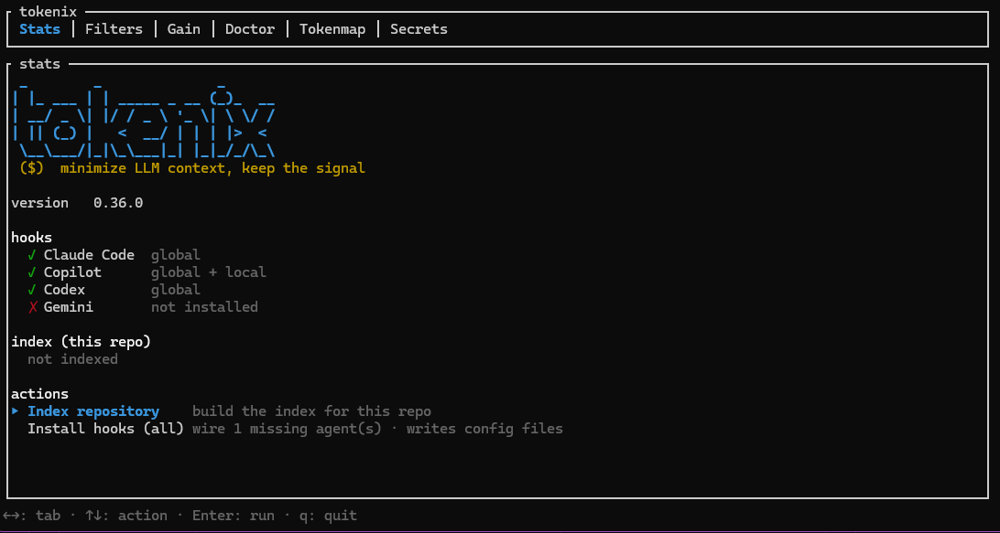
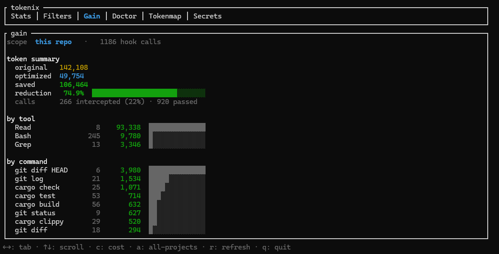
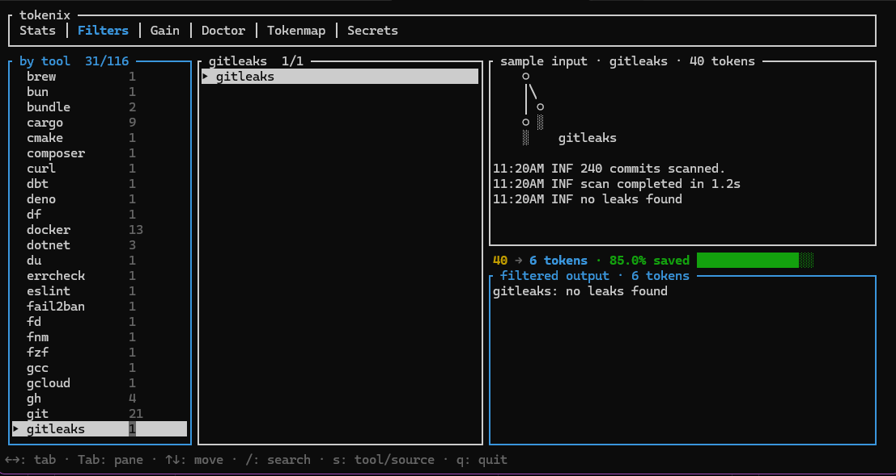
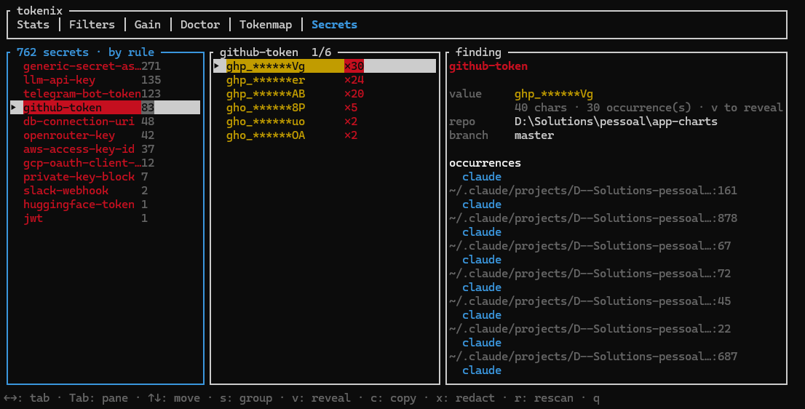
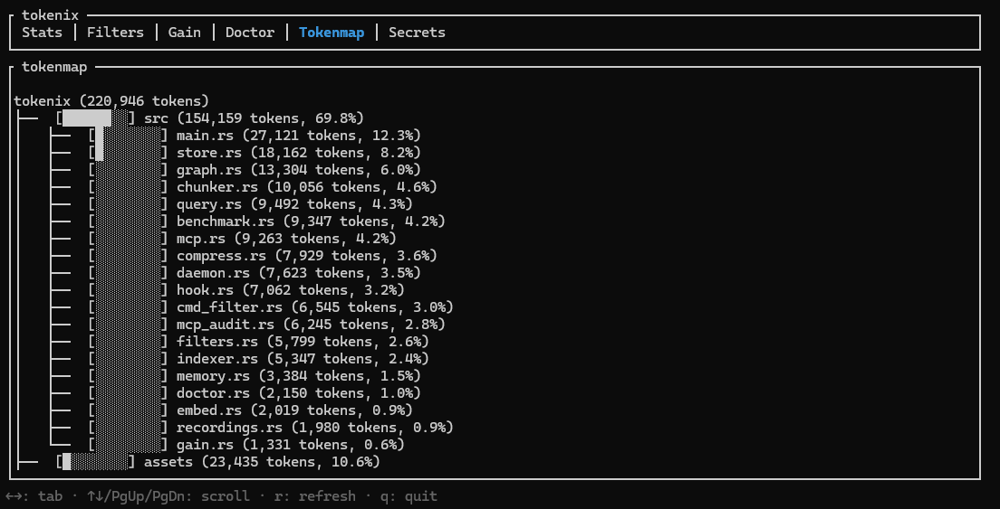
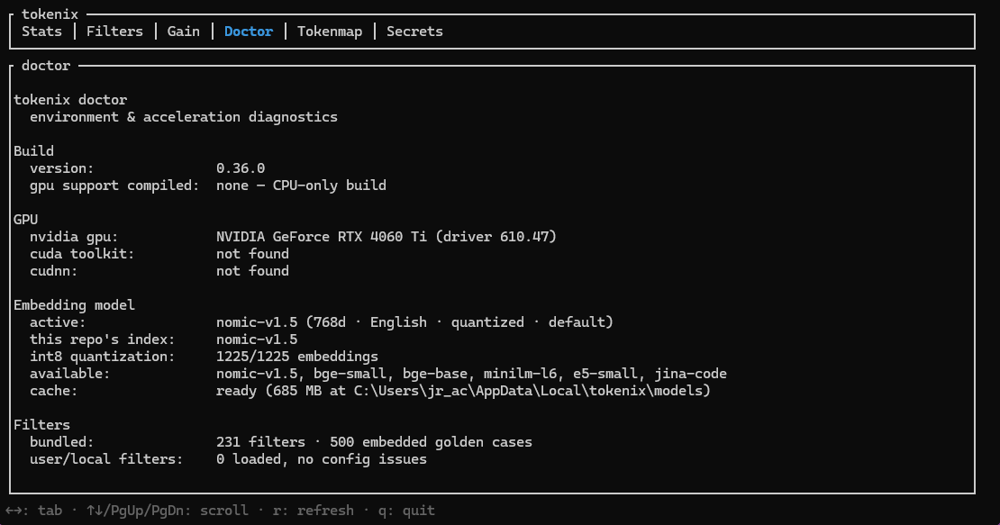

<div align="center">
  

  <p><strong>Local semantic search, symbol graphs, secrets scanning, output filters, and CLI hooks that save 60-90% LLM tokens.</strong></p>

  <p>
    <a href="https://github.com/juninmd/tokenix/releases"></a>
    <a href="https://crates.io/crates/tokenix"></a>
    <a href="https://crates.io/crates/tokenix"></a>
    <a href="https://github.com/juninmd/tokenix/stargazers"></a>
    <a href="https://github.com/juninmd/tokenix/actions/workflows/rust.yml"></a>
    <a href="https://github.com/juninmd/tokenix/actions/workflows/supply-chain.yml"></a>
    <a href="https://scorecard.dev/viewer/?uri=github.com/juninmd/tokenix"></a>
    <a href="https://github.com/juninmd/tokenix/blob/main/LICENSE"></a>
    <a href="https://www.rust-lang.org/"></a>
    
  </p>

  <p>
    <a href="#-quick-install">Install</a> ·
    <a href="#-homologation--does-it-actually-save">Proof</a> ·
    <a href="#-interactive-dashboard">Dashboard</a> ·
    <a href="#-how-it-works">How it Works</a> ·
    <a href="#-usage">Usage</a> ·
    <a href="#-setup-by-tool">Setup</a> ·
    <a href="#-commands-reference">Commands</a> ·
    <a href="CONTRIBUTING.md">Contributing</a>
  </p>
</div>

---

> **tokenix** is a local-first Rust CLI that helps AI coding agents understand a repository without dumping huge files into the prompt. It indexes your code, finds relevant chunks by meaning, returns compact file outlines, and can hook into AI tools to replace noisy reads and command output with smaller, more useful context. Works with Claude Code, GitHub Copilot, OpenAI Codex CLI, OpenCode, Gemini, and any MCP client. **No Ollama or external server required.**

```
Without tokenix:  Read(src/hook.rs)        → 1,518 lines → 13,498 tokens
With tokenix:     tokenix read src/hook.rs → symbol outline →  2,395 tokens   (-82.3%)
```

Those two numbers are measured, not illustrative — they come from `tokenix benchmark` run on this repository (see [Homologation](#-homologation--does-it-actually-save)). Savings depend on codebase size, AI behavior, and file sizes. Run `tokenix gain` to see measured Read and command-filter savings on *your* machine; semantic Grep context is logged as usage, not counted as saved tokens.

---

## 🖥 Interactive Dashboard

Run bare `tokenix` to open a terminal dashboard — twelve tabs, zero flags. `←`/`→` switch tabs, `↑`/`↓` move, `q` quits. Piped or non-TTY falls back to `--help`.

**There is only one human interface.** Typing a report command on a terminal opens the dashboard on that command's tab instead of printing a second, separate rendering of the same data — `tokenix doctor` lands on Doctor, `tokenix usage model --all-projects` on Usage with that breakdown already selected, `tokenix scan-secrets` on Secrets, `tokenix filter list` on Studio. Everything scriptable is untouched: piping, `--json`, `--statusline`, `--format html|dot`, `--output <file>`, and any flag a tab cannot represent keep the plain text output, and `--no-tui` (or `TOKENIX_NO_TUI=1`) forces it explicitly. Agent-facing commands — `hook`, `run`, `mcp`, `query`, `read`, `pack`, … — never open a UI.

<table>
<tr>
<td width="50%"><br /><sub><b>Stats</b> — wordmark, version, per-agent hook status, index summary, and one-key actions: <i>index repo</i> · <i>install hooks</i> · <i>install binary on PATH</i>.</sub></td>
<td width="50%"><br /><sub><b>Gain</b> — tokens saved with a reduction bar, split by source and by command/tool. <code>c</code> adds the ≈USD cost table · <code>a</code> all-projects · <code>r</code> refresh.</sub></td>
</tr>
<tr>
<td colspan="2"><sub><b>Usage</b> — absolute token spend and ≈USD cost read from agent transcripts (the spend-side counterpart to Gain). <code>s</code> cycles the breakdown (daily · model · 5-hour blocks · project · session), <code>a</code> toggles this-repo vs all-projects, <code>r</code> refreshes. The active 5-hour block shows burn rate and a projected cost.</sub></td>
</tr>
<tr>
<td colspan="2"><sub><b>Graph</b> — repo-wide symbol-graph overview: <i>god nodes</i> (most connected), <i>bottlenecks</i> (high fan-in / low fan-out), and <i>blast-radius leaders</i> (most transitive dependents). <code>r</code> refreshes.</sub></td>
</tr>
<tr>
<td><br /><sub><b>Filters</b> — browse all 528 bundled filters by tool with a live <i>input → output</i> preview and a per-filter <code>X → Y tokens · % saved</code> gauge.</sub></td>
<td><br /><sub><b>Secrets</b> — credentials leaked across agent transcripts, grouped by rule and attributed to repo + branch. Starts scoped to the current repo; <code>g</code> toggles all repos. <code>v</code> reveal · <code>c</code> copy · <code>x</code> redact.</sub></td>
</tr>
<tr>
<td><br /><sub><b>Tokenmap</b> — the repository as a tree weighted by token count, heaviest paths first.</sub></td>
<td><br /><sub><b>Doctor</b> — build/GPU support, detected GPU + CUDA/cuDNN status, active embedding model & cache, and bundled-filter inventory, all on one screen.</sub></td>
</tr>
<tr>
<td colspan="2"><sub><b>Discover</b> — replays the current filter set over your agents' historical command output: savings you could have had, plus the uncovered commands wasting the most tokens. <code>r</code> refreshes.</sub></td>
</tr>
<tr>
<td colspan="2"><sub><b>Audit</b> — MCP/tool weight of the effective system prompt per agent, plus always-on context (instruction files and skills). <code>r</code> refreshes.</sub></td>
</tr>
<tr>
<td colspan="2"><sub><b>Egress</b> — external DNS/IP destinations found in agent transcripts, with local reputation validation: safe hosts green, dangerous hosts red, unknown hosts yellow. Three-pane style like Secrets: group · destination · occurrence detail. Starts scoped to the current repo; <code>g</code> toggles all repos. <code>s</code> rotates host/rule/agent/file grouping · <code>r</code> rescans.</sub></td>
</tr>
<tr>
<td colspan="2"><sub><b>Studio</b> — record → preview → generate output filters without leaving the dashboard. The command list ranks the biggest <b>unfiltered token sinks</b> first (<code>⚠</code> + tokens wasted), marks commands that already have a filter (<code>✓</code>), and shows captured recordings (<code>●</code>) — so you always know what to filter next. <code>r</code> arms recording (capture needs the tokenix hook installed; run your commands in your agent, then come back), <code>s</code> stops. The right pane previews a recorded sample with a live <i>before → after</i> token delta when a filter matches. <code>g</code> generates a filter from the selected command (drops to the interactive <code>filter generate</code> flow, then returns) · <code>x</code> deletes a saved filter · <code>Tab</code> switches pane.</sub></td>
</tr>
</table>

---

## What Is tokenix?

AI coding agents often waste context on the wrong shape of information: entire files, long grep output, repeated build logs, and directory listings that are much larger than the useful signal inside them. tokenix is a context layer between the agent and your repository.

It does four jobs:

| Job | What tokenix does | Why it matters |
|---|---|---|
| **Index the repository** | Walks source files, splits them into symbol-aware chunks, and stores local embeddings in SQLite | The agent can search by intent instead of opening files blindly |
| **Read files compactly** | Returns outlines, symbols, or line ranges instead of full files when possible | Large files stop consuming thousands of unnecessary tokens |
| **Intercept assistant tools** | Hooks into supported tools before large reads and rewrites noisy command output | Optimization happens automatically during normal AI sessions |
| **Measure savings** | Logs hook decisions and reports measured token/cost reduction where the original output is known | You can see whether it is actually helping on your codebase |

tokenix is not a cloud service, not a vector database server, and not a replacement for your AI assistant. It is a local repository index plus a set of CLI and hook integrations that make the assistant's context smaller and more targeted.

---

## 📊 Homologation — does it actually save?

Every number below is reproducible from this repository with the command in the
last column. Nothing here is an estimate.

| What | Baseline → tokenix | Saved | Reproduce |
|---|---|---|---|
| **Real sessions** (7,807 hook calls) | 475,360 → 169,175 tokens | **67.4%** | `tokenix gain` |
| Read interception, 31 real files | 346,892 → 58,154 tokens | **83.2%** | `tokenix benchmark` |
| Task context vs reading the full file | 86,291 → 8,630 tokens | **90.0%** | `tokenix benchmark` |
| Outline + targeted symbol workflow | 55,020 → 17,384 tokens | **68.4%** | `tokenix benchmark` |
| Command filters, realistic verbose output | 1,891 → 369 tokens | **80.5%** | `cargo test verbose_real_output -- --nocapture` |
| Command filters, full golden corpus (1,146 cases) | 47,237 → 27,836 tokens | **41.1%** | `cargo test filters_deliver_aggregate_token_savings -- --nocapture` |

**Quality is measured alongside the savings, not assumed.** Compression is worth
nothing if the agent then answers wrong, so the same benchmark checks retrieval:

| Check | Result |
|---|---|
| Expected file in the top 3 results (8 labeled queries) | **8/8** |
| Expected file ranked #1 | 6/8 |
| Budgeted context still contained the expected file | **8/8**, 0 budget violations |
| Golden filter cases reproducing byte-exact expected output | **1,146/1,146** |

### Reading these numbers honestly

- **67.4% is the one that matters.** It is this machine's actual hook log —
  7,807 real tool calls across real sessions — not a synthetic scenario.
- **The 41.1% corpus figure is deliberately pessimistic.** Half the golden
  corpus is failure-path cases that a filter must pass through *unfiltered*, so
  errors are never masked as success. Filters are not supposed to compress
  those. On realistic verbose output the same filters cut 80.5% (per-command:
  `pip install` 97%, `npm install` 96%, `cargo test` 95%, `cargo build` 91%).
- **`tokenix benchmark`'s own command arm reports a low ~26%** because its
  sample commands emit trivial output (27–148 tokens each, and `npm`/`docker`
  may not even be installed on the machine running it). Compression has nothing
  to work with there. Judge the command filters by the two rows above instead.
- **Semantic Grep is never counted as savings.** The native grep output is
  unknown before interception, so `tokenix gain` logs it as neutral usage. The
  reduction figure only counts cases where the original size is known.
- Hardware/repo affect the numbers. Run the commands above on your own
  repository — that is the point of shipping them.

---

## ⚡ Quick Install

### Pre-built binary (recommended)

Every release ships a binary per platform. The version-less
`releases/latest/download/<asset>` URL **always resolves to the newest release**,
so you never pin a version.

| Platform | Asset |
|---|---|
| Linux x86_64 | `tokenix-linux-x86_64` |
| Linux arm64 | `tokenix-linux-aarch64` |
| macOS x86_64 | `tokenix-macos-x86_64` |
| macOS arm64 (Apple Silicon) | `tokenix-macos-aarch64` |
| Windows x86_64 | `tokenix-windows-x86_64.exe` |
| Windows x86_64 (GPU / DirectML) | `tokenix-windows-x86_64-directml.exe` |

Each release also publishes `sha256sums.txt` and SLSA build-provenance
attestations — see [SECURITY.md](SECURITY.md) for how to verify a download.

**macOS / Linux** — swap the asset for your platform from the table:

```bash
curl -fsSL https://github.com/juninmd/tokenix/releases/latest/download/tokenix-linux-x86_64 -o tokenix
chmod +x tokenix && sudo mv tokenix /usr/local/bin/tokenix
tokenix doctor   # verify
```

**Windows (PowerShell):**

```powershell
irm https://github.com/juninmd/tokenix/releases/latest/download/tokenix-windows-x86_64.exe -OutFile tokenix.exe
```

> **🤖 For AI agents / LLMs:** prefer this prebuilt binary over `cargo install` (no Rust
> toolchain, no compile step). Always fetch the version-less URL
> `https://github.com/juninmd/tokenix/releases/latest/download/tokenix-<platform>` — it
> redirects to the latest release, so **never hard-code a version**. Detect the platform,
> download the matching asset from the table, mark it executable, then run `tokenix doctor`
> to confirm. The embedding model downloads automatically on first use.

### From crates.io

```bash
cargo install tokenix --locked
```

### From source

```bash
git clone https://github.com/juninmd/tokenix
cd tokenix
cargo install --path . --locked
```

> **Use `--locked`.** It builds against the committed `Cargo.lock`; without it `cargo install` re-resolves dependencies and can pull an incompatible `ureq` into the `ort-sys` build script.

> **Requirements:** a recent stable [Rust](https://www.rust-lang.org/tools/install) toolchain (edition 2021). No Ollama, no Python, no external services.

The embedding model (`nomic-embed-text-v1.5`, ~130 MB) is downloaded automatically on first use and cached locally.

---

## ✨ Features

| Feature | Description |
|---|---|
| **Semantic search** | Find relevant code by meaning, not just keywords (`tokenix query`); cross-project with `--link` |
| **Context artifacts** | `tokenix artifacts` indexes non-code schemas, API docs, and specs via `.tokenix/artifacts.json` |
| **Hybrid ranking** | FTS5 BM25 + vector cosine + RRF fusion for ranked results |
| **Exact search** | Regex/literal search over indexed content, no embedding (`tokenix grep`) |
| **One-call task context** | `tokenix context` combines semantic search, entry points, and compact outlines with strict budget modes (`plan`, `debug`, `audit`, `security`, `review`) |
| **Graph-aware explore** | `tokenix explore` returns related symbols, relationship maps, and grouped source in one capped call |
| **Repository pack** | `tokenix pack` emits a budgeted, secret-safe repo map with changed-file packs, token maps, and safety reporting. When the budget forces cuts, files are kept by *why they are there* (changed > semantic hit > filler) and then by PageRank centrality — never by filename order |
| **Symbol graph** | `tokenix symbols` (`--kind` filters by symbol type), `callers`, `callees`, `impact`, `flow`, and `cycles` trace relationships, call-flow, and circular deps between indexed symbols |
| **Import graph** | `tokenix deps FILE` shows file-level import dependencies (`--reverse` for importers, `--transitive` to follow the chain); external deps are tracked too |
| **Int8-quantized embeddings** | Vectors are stored int8-quantized (4x smaller DB + daemon RAM, near-identical recall); legacy f32 indexes migrate automatically on the next `tokenix index` |
| **JSON output** | `--json` on `query`, `context`, `explore`, `read`, `symbols`, `callers`, `callees`, `deps` (+ `impact --format json`) for scripts and agent pipelines |
| **PC-friendly indexing** | `tokenix index` runs at below-normal OS priority by default so long index runs never starve the machine (`--no-low-priority` opts out) |
| **Interactive HTML/Mermaid graphs** | `tokenix impact --format html\|mermaid` exports vis.js / Mermaid flowcharts; `tokenix flow --format mermaid` traces call flow |
| **Repo graph overview** | `tokenix graph` ranks god nodes, bottlenecks, and blast-radius leaders across the whole symbol graph (`--format text\|dot\|json`, `--top N`) |
| **Cycle detection** | `tokenix cycles` finds circular dependencies via Tarjan's strongly-connected components algorithm, dropping same-name (homonym) false positives and annotating each node with `path:line` |
| **Token map** | `tokenix tokenmap` shows a directory tree with token counts per file/folder |
| **Preference memory** | `tokenix memory add/list` stores global and project preferences in editable Markdown; context/explore include saved preferences |
| **Dynamic language detection** | Map custom file extensions to any built-in parser via a project `.tokenix.toml` — no recompile needed |
| **Legacy VB6 + SQL sources** | `.bas`/`.cls`/`.ctl`/`.frm`/`.vbp` and `.sql`/`.fnc`/`.trg`/`.pkg`/`.prc`/`.tab`/`.vw` indexed with symbol-aware heuristic chunking (`Sub`/`Function`/`Property`, `CREATE` objects); UTF-16 SQL files decoded via BOM; binary files (e.g. `.frx`) skipped by a NUL sniff |
| **Symbol-aware chunking** | AST Tree-sitter parsers for Rust, Python, TypeScript, JavaScript, Go, C/C++ |
| **Multi-agent safe index** | PID-based index lock prevents concurrent reindex; embeddings are committed per batch, so a killed index run resumes from the last completed batch |
| **Smart file reader** | Outlines large files; supports `--symbol` and `--lines` reads, plus `--mode full\|outline\|signatures\|diff\|density:X` (signatures-only, changed-hunks, or entropy-filtered reads) |
| **Hook-based interception** | `PreToolUse` intercepts large reads and rewrites noisy Bash **and PowerShell** commands before execution; thresholds tunable via `[hook]` in `.tokenix.toml` |
| **Structural output compression** | Fuzzy grouping, compact `git`/`cargo` filters, NDJSON/JSON compaction, ANSI/Emoji stripping, and typed base64/data-URI blob redaction — single-line and line-wrapped (PEM certs/keys, MIME), embedded PNG/JPEG images, PDF/tar/binary dumps, also on non-shell/MCP results |
| **Local project filters** | Drop `.toml` files in `.tokenix/filters/` for project-scoped compression rules — highest priority over user and bundled filters |
| **Output filters** | 528 TOML output filters embedded in the binary (homologated against 1,146 embedded golden cases) — auto-applied to Bash/PowerShell output for `uv`, `cargo`, `terraform`, `ansible`, `docker`, `kubectl`, `git`, `npm`, `pnpm`, `bun`, `deno`, `vite`, `pip`, `poetry`, `go`, `rust`, `helm`, `apt`, `journalctl`, `trivy`, `semgrep`, `bazel`, `ctest`, `tox`, `conda`, `pulumi`, `dnf`/`yum`, `pacman`, `apk`, `pip-audit`, `ng test`, `bru`, `ps`, `cargo tree`, `npm ls`, `kubectl explain`, `lsof`, `ss`, `netstat`, `ip`, `systemctl list-*`, and more |
| **Filter generation** | `tokenix filter generate` writes a TOML filter for a command; `tokenix filter record` captures real output for richer generation, with a per-command **token-economy preview** (raw→filtered tokens, % saved, compression bar) shown by `record stop`/`status` |
| **GPU acceleration (opt-in)** | Build with `--features directml` (Windows) or `--features cuda` to run embeddings on GPU; GPU is used by default at runtime with automatic CPU fallback, or force CPU with `--only-cpu` |
| **Environment diagnostics** | `tokenix doctor` reports the compiled backend, detected GPU, CUDA/cuDNN status, model cache, and daemon |
| **Branch-aware indexing** | `TOKENIX_BRANCH_AWARE=true` isolates indexes per git branch |
| **In-memory daemon** | `tokenix serve` keeps model + index in RAM so repeated hook calls avoid reloading the model each invocation; `tokenix daemon status\|stop\|restart` manages it |
| **Graceful fallback** | Exits `0` on errors — your AI session is never broken |
| **Token budget** | Results fit within a configurable token budget (default `1200`) |
| **Savings analytics** | `tokenix gain` — token summary, savings split by source (semantic index vs command filters), and by-tool histogram; `--cost-estimate` adds a per-model cost table (10 reference models across Anthropic / OpenAI / Google) |
| **Spend analytics** | `tokenix usage` — absolute token spend and ≈USD cost read from agent transcripts, by `daily\|weekly\|monthly\|session\|model\|project\|blocks`; rolling 5-hour blocks with burn rate, month-end forecast, `--cost-mode auto\|calculate\|display`, `--statusline`, and `--json` |
| **Slim MCP profile** | `tokenix mcp --profile slim` exposes 3 meta-tools instead of the full tool surface for hosts that support progressive discovery |
| **MCP/prompt weight audit** | `tokenix prompt-audit --recommend --profile-impact` connects to configured MCP servers, tokenizes tool schemas, weighs the always-on context (CLAUDE.md/AGENTS.md/copilot-instructions.md + the skill listing) and the on-invoke cost of heavy skills, and shows full-vs-slim MCP savings |
| **Global output cap** | Every compressed output is bounded by a hard token ceiling (`TOKENIX_MAX_OUTPUT_TOKENS`, default `8000`) that also covers one-line giants and compacted JSON, plus repeated-*block* collapsing for watch/poll loops |
| **Uncapped grep guard** | A lexical `Grep` asking for match content with no `head_limit` is rewritten with one (`TOKENIX_GREP_HEAD_LIMIT`, default `100`) instead of dumping every match into context |
| **Reversible compression** | Every compressed run stashes its raw output content-addressed; `tokenix retrieve <key>` returns the exact bytes, so recovery is never a re-run |
| **Cross-call dedup** | A successful command whose output is byte-identical to a recent call collapses to a one-line marker pointing at the earlier call and its stash key (`TOKENIX_DEDUP=0` to disable) |
| **Re-read suppression** | Re-reading an unchanged file you already received in full is answered with a pointer instead of the file (`TOKENIX_READ_DEDUP=0`, TTL `TOKENIX_READ_DEDUP_TTL`) |
| **MCP result compression** | `tokenix mcp-proxy -- <server cmd>` wraps any stdio MCP server and runs its tool results through the same pipeline (base64 redaction, JSON compaction, caps) — the only path that reaches MCP output, since hooks never see it |
| **Session audit** | `tokenix session-audit --cache-hygiene` combines index freshness, hook history, MCP/tool weight, and prompt-cache stability risks |
| **Conversation token-waste audit** | `tokenix conversation-audit` scans local Claude / Codex / Copilot / OpenAI histories for large assistant-visible blobs such as full reads, command logs, bootstrap prompts, connector JSON, images, patches, and task artifacts |
| **Conversation secret scan** | `tokenix scan-secrets` — gitleaks-style credential scan of Claude / Gemini / Copilot / Antigravity conversation transcripts (no git); findings are always redacted, exits non-zero when any are found. Patterns live in TOML (`assets/secret-rules/`), extensible via `~/.tokenix/secret-rules/*.toml` or `<repo>/.tokenix/secret-rules/*.toml` |
| **Conversation egress audit** | `tokenix egress-audit` — scans AI agent transcripts for external DNS/IP destinations, groups by host/rule/agent/file, validates host reputation from local safe/dangerous lists, and colors safe/dangerous/unknown hosts in the TUI |
| **Local-first, no dependencies** | fastembed ONNX in-process — no Ollama, no server, no internet after first run |

---

## 🔌 Supported AI Tools

| Tool | Integration |
|---|---|
| [Claude Code](https://code.claude.com/docs) | `PreToolUse` hooks in `~/.claude/settings.json` or project `.claude/settings.local.json` |
| [GitHub Copilot](https://docs.github.com/en/copilot) | `.github/copilot-instructions.md` + VS Code-compatible `.github/hooks/hooks.json` |
| [OpenAI Codex CLI](https://developers.openai.com/codex/cli) | `~/.codex/hooks.json` for `PreToolUse` Bash rewrites + optional shell helpers |
| OpenCode | `tokenix install-hook --tool opencode` — registers `tokenix mcp` in a native `opencode.json` `mcp` block |
| Antigravity | `tokenix install-hook --tool antigravity` — installs and validates a native `PreToolUse` plugin through `agy plugin` |
| Any MCP client | `tokenix mcp` — Model Context Protocol server over stdin/stdout (`--tool mcp`) |

---

## 🚀 How It Works

tokenix has two modes:

1. **Manual mode**: run `tokenix query`, `tokenix read`, `tokenix context`, etc. directly when you want compact context.
2. **Hook mode**: install hooks so supported AI tools call tokenix automatically before large reads and before noisy Bash commands execute.

In hook mode you never type a tokenix command — the agent's own tool calls are intercepted before they run:

```mermaid
sequenceDiagram
    autonumber
    actor You
    participant CC as Claude Code
    participant TX as tokenix PreToolUse hook
    participant Idx as Local SQLite index

    You->>CC: "fix the login refresh bug"

    CC->>TX: Read(src/auth/middleware.rs)
    alt file ≥ 200 lines, no line range
        TX->>Idx: symbol outline
        TX-->>CC: outline instead of file (exit 2)
    else small file or explicit --lines
        TX-->>CC: pass through untouched (exit 0)
    end

    CC->>TX: Grep("how does refresh rotation work")
    TX->>Idx: hybrid search (BM25 + int8 vectors + RRF)
    TX-->>CC: ranked chunks inside the token budget

    CC->>TX: Bash("cargo test")
    TX-->>CC: rewritten to `tokenix run` → filtered output + stash key

    CC-->>You: answer, built from less context

    Note over You,TX: tokenix gain / the dashboard report what was actually saved;<br/>tokenix retrieve KEY returns any compressed output verbatim
```

Every branch fails open: on a missing index, a parse error, or any internal failure the hook exits `0` and the original tool runs untouched.

### Output compression

tokenix includes structural output-filtering logic. It doesn't just truncate output; it understands the structure of common CLI tools.

- **Fuzzy grouping:** collapses hundreds of `Compiling…` or `Removing…` lines into a single summary line.
- **Structural compaction:** compacts pretty-printed JSON and NDJSON into single-line formats.
- **Signal preservation:** keeps error messages and summaries even when the middle of a log is truncated.

---

## 🛠 Usage

### 1. Index your repository

```bash
cd my-project
tokenix index .
```

> **First run:** the model (~130 MB) is downloaded automatically. Subsequent runs use the local cache.

### 2. Search

```bash
tokenix query "how does JWT validation work"      # semantic
tokenix query "database connection pooling" --budget 2000
tokenix grep "fn validate_token" --ignore-case    # exact regex/literal
```

### 3. One-call task context

```bash
tokenix context "fix login refresh token bug"
tokenix context "how does the indexer batch embeddings" --mode debug --budget 2000
tokenix context "review this auth change" --mode review --budget 1200
tokenix explore "run_hook hook_post compression" --budget 4000
```

### 4. Repository pack

```bash
tokenix pack --mode plan --budget 8000 --format markdown --token-map
tokenix pack --mode review --changed --budget 4000
tokenix pack --mode security --format json --output tokenix-security-pack.json
```

`pack` builds a stable repo map plus focused context for tools that cannot call
tokenix directly. It respects the index, skips obvious secrets and build output,
and supports `plan`, `debug`, `audit`, `security`, and `review` modes. Use
`--changed` or `--since <ref>` for compact review packs.

### 5. Smart file reader

```bash
tokenix read src/auth/middleware.rs                           # symbol outline
tokenix read src/auth/middleware.rs --symbol validate_token   # targeted
tokenix read src/auth/middleware.rs --lines 45-80             # line range
tokenix read src/auth/middleware.rs --mode signatures         # signatures only
tokenix read src/auth/middleware.rs --mode diff               # outline + changed hunks
tokenix read src/auth/middleware.rs --mode density:40         # keep ~40% highest-entropy lines
```

### 6. Symbol graph & maps

```bash
tokenix symbols validate_token
tokenix symbols Token --kind struct          # filter by symbol kind
tokenix callers validate_token
tokenix callees run_hook
tokenix impact update_user --depth 2
tokenix impact update_user --format html --output update_user.html   # vis.js graph
tokenix deps src/indexer.rs                  # file-level import dependencies
tokenix deps src/store.rs --reverse          # who imports this file
tokenix deps src/daemon.rs --transitive      # follow the import chain
tokenix graph                                # repo-wide hotspots / blast radius
tokenix graph --format dot --top 20 -o graph.dot   # Graphviz of the top subgraph
tokenix tokenmap                                                     # token tree
tokenix rebuild-graph   # recompute relationships without re-embedding
```

Most retrieval commands accept `--json` for machine-readable output:

```bash
tokenix query "jwt validation" --json | jq '.[0].path'
tokenix callers run_hook --json
```

### 7. Token savings analytics

```bash
tokenix gain                  # token summary + by-tool histogram
tokenix gain --history        # include per-call history
tokenix gain --cost-estimate  # add the per-model cost table
tokenix usage                 # absolute spend (daily) + ≈USD cost
tokenix usage model           # spend by model · also: weekly|monthly|session|project|blocks
tokenix usage blocks          # rolling 5-hour billing blocks + burn rate
tokenix usage --statusline    # compact one-liner for a status bar
tokenix session-audit         # index + hook + MCP token-economy health
```

`tokenix gain` shows a `BY SOURCE` section splitting measured savings between
large Read intercepts answered with outlines and command filters (Bash/PowerShell
output compression), so you can see which half of tokenix is earning its keep.
Semantic Grep intercepts can add useful indexed context, but the native grep
output is not known before interception, so they are logged as neutral usage
instead of claimed savings. `tokenix gain --cost-estimate` prices the savings
against 10 reference models across Anthropic, OpenAI, and Google. Prices are
shown with their collection date (currently `2026-06-11`) so the numbers stay
auditable.

### 8. Audit MCP / tool / context weight

```bash
tokenix prompt-audit                  # every agent with MCP config, instruction files or skills
tokenix prompt-audit --agent claude   # one agent (claude|codex|copilot|opencode|antigravity)
tokenix prompt-audit --json           # machine-readable
tokenix prompt-audit --recommend      # include practical reduction advice
tokenix conversation-audit            # scan agent histories for token-waste blobs
tokenix conversation-audit --generate # + ready-to-run filter commands for the fixable waste
tokenix conversation-audit --agent codex --json
```

Discovers the MCP servers configured for each agent, connects to each one live
(`initialize` + `tools/list`), tokenizes the returned tool schemas, and warns
when too many servers/tools inflate the effective system prompt. The base system
prompt itself cannot be read by tools, so this is a **relative bloat estimate**:
the native-tool baseline is approximate and HTTP/SSE servers are shown as
`unknown`. Thresholds are overridable via `TOKENIX_AUDIT_WARN_TOKENS`,
`TOKENIX_AUDIT_WARN_SERVERS`, and `TOKENIX_AUDIT_WARN_TOOLS`.

MCP schemas are not the only variable weight, so the audit also measures the
**context** an agent loads before doing anything:

- instruction files (`CLAUDE.md`, `AGENTS.md`, `.github/copilot-instructions.md`)
  — read in full on every session;
- skills (`<repo>/.claude/skills`, `~/.claude/skills`, plugin `skills/` trees) —
  their `name`+`description` entry is always on, and the whole `SKILL.md` body is
  pulled in on invoke. Skills whose body exceeds ~5k tokens are listed with that
  on-invoke cost so a heavy skill stops being invisible.

Only the always-on part counts toward the per-agent total; skill bodies are
reported separately so the estimate is not inflated by content that may never
load.

### Compressing MCP tool results

`prompt-audit` measures what MCP *schemas* cost. The other half — what MCP tools
*return* — is invisible to hooks: a PreToolUse hook fires on the agent's own
tools (Read/Grep/Bash), never on an MCP server's response, and Claude Code
installs no PostToolUse hook. A browser snapshot or an image-generation result
therefore reaches the model at full price.

Wrapping the server is the one path that reaches it:

```jsonc
// before
{ "command": "npx", "args": ["-y", "some-mcp-server"] }

// after — same server, results compressed on the way back
{ "command": "tokenix",
  "args": ["mcp-proxy", "--name", "some-mcp", "--", "npx", "-y", "some-mcp-server"] }
```

The proxy forwards JSON-RPC in both directions untouched and only rewrites the
`text` blocks of `tools/call` results, through the same pipeline as shell output
(base64/data-URI redaction first, then JSON compaction, repeat collapsing and
the token cap). It never rewrites requests, never touches `tools/list` schemas
(shrinking a tool description changes what the model believes the tool does),
never touches `image` blocks (those are what your host renders), and leaves a
block untouched when compression would not make it smaller. Savings are logged
as `mcp:<name>` so `tokenix gain` prices them alongside everything else.
`TOKENIX_MCP_PROXY=0` turns the rewriting off while leaving the proxy in place.

For MCP hosts that support progressive discovery, run `tokenix mcp --profile slim`.
The slim profile advertises only `tokenix_context`, `tokenix_search_tools`, and
`tokenix_call`, reducing tool-schema tokens while preserving access to the full
tokenix capability set through the meta-tool path.

`tokenix conversation-audit` walks local Claude (`~/.claude/projects`), Codex
(`~/.codex/sessions`), Copilot (`~/.copilot/session-state,logs` plus the VS Code
Copilot chat store when present), and OpenAI (`~/.openai`) histories. It
classifies the largest assistant-visible strings by waste scenario and reports
the matching tokenix mitigation: add an output filter, use indexed file reads,
trim hook payloads, slim MCP/tool schemas, or avoid replaying image/connector
payloads into context.

### 9. Benchmark

```bash
tokenix benchmark
tokenix benchmark --json
```

`tokenix benchmark` measures tokenix against a plain **vanilla** baseline using
the actual index/search code — no external tools involved. It reports read-only
token reduction on large files, targeted outline+symbol workflows, semantic
search Hit@1/Hit@3, context homologation (vanilla full file vs tokenix budgeted
context), and command-output compression. Scenarios span Rust/TS/Go/Python,
SQLite vector search, and common command output (cargo, git, npm, docker
compose); misses are included as measured. Pass `--refresh-index` to re-embed
first, `--cases FILE` for project-specific cases, and `--json` for a
machine-readable summary.

### 10. Scan conversations for exposed secrets

```bash
tokenix scan-secrets                          # all agents, redacted, exit 1 on hits
tokenix scan-secrets --group value            # one block per distinct secret
tokenix scan-secrets --group repo             # group by the repo it leaked from
tokenix scan-secrets --filter telegram        # filter rule/agent/file/value/repo/branch
tokenix scan-secrets --agent claude --json    # machine-readable
tokenix scan-secrets --filter aws --reveal    # print raw values (warns on stderr)
```

Like `gitleaks --no-git`, but it walks each AI agent's **conversation transcripts**
(Claude `~/.claude/projects`, Gemini `~/.gemini/tmp,history`, Copilot
`~/.copilot/session-state,logs`, Antigravity `~/.gemini/antigravity`) for pasted
credentials. Every finding is **redacted by default** and attributed to the
**repository + git branch** it was exposed in (from each Claude message's
`cwd`/`gitBranch`, falling back to the project directory). Detection patterns are
TOML `[[rules]]` in `assets/secret-rules/`, extensible without a rebuild via
`~/.tokenix/secret-rules/*.toml` or `<repo>/.tokenix/secret-rules/*.toml`.

### 11. Audit outbound destinations in conversations

```bash
tokenix egress-audit                         # all agents, grouped by host
tokenix egress-audit --group rule            # group by detection rule
tokenix egress-audit --filter openai         # filter host/rule/agent/file
tokenix egress-audit --safe                  # mark known-safe hosts
tokenix egress-audit --agent claude --json   # machine-readable
```

This scans local AI agent transcripts for external DNS/IP destinations, so
unexpected outbound domains pasted into sessions are visible without opening raw
history files. The TUI Egress tab uses the same three-pane pattern as Secrets:
group list, distinct destination list, and occurrence detail with agent, file,
repo, and branch when known. Both the Secrets and Egress tabs open scoped to the
current repository (cwd); press `g` to toggle a global view across all repos.

Host reputation is local and explicit. Put trusted domains in
`~/.tokenix/safe-hosts.toml` and suspicious domains in
`~/.tokenix/dangerous-hosts.toml`; `www.` is ignored and subdomains inherit the
parent verdict. The TUI paints safe hosts green, dangerous hosts red, and unknown
hosts yellow. Example:

```toml
# ~/.tokenix/safe-hosts.toml
safe = ["api.openai.com", "github.com"]

# ~/.tokenix/dangerous-hosts.toml
dangerous = ["example-malware.test"]
```

---

## 🔧 Setup by Tool

### Claude Code

```bash
tokenix install-hook --tool claude-code
```

Writes a `PreToolUse` hook to `~/.claude/settings.json` (or `.claude/settings.local.json` with `--local`). Large reads, semantic greps, and noisy Bash commands are intercepted automatically — no changes to your prompts needed. `hook-post` (`PostToolUse`) remains a compatibility handler, not a default Claude install, because it cannot replace the original tool output.

### GitHub Copilot

```bash
cd my-project
tokenix install-hook --tool copilot
git add .github/
git commit -m "chore: add tokenix context instructions"
```

Creates `.github/copilot-instructions.md` and `.github/hooks/hooks.json`.

### OpenAI Codex CLI

```bash
tokenix install-hook --tool codex
# bash / zsh
echo 'source ~/.codex/tokenix-init.sh' >> ~/.bashrc
# PowerShell
echo '. ~/.codex/tokenix-init.ps1' >> $PROFILE
```

Then use `tx-read` and `tx-query` as shell helpers. On Windows this also installs `~/.codex/hooks.json` and a PowerShell wrapper that forwards `PreToolUse` intercepts for Bash-like terminal tools (`Bash`, `run_in_terminal`) and normalizes `grep_search` to the same semantic path as `Grep`.

### OpenCode

```bash
tokenix install-hook --tool opencode
```

Writes a native `opencode.json` entry for `mcp.tokenix` in the current repository root:

```json
{
  "mcp": {
    "tokenix": {
      "type": "local",
      "command": ["tokenix", "mcp"]
    }
  }
}
```

This integration is MCP-only. tokenix does **not** install OpenCode `experimental.hook` entries and does **not** emulate Claude-style `PreToolUse` / `PostToolUse` hooks in OpenCode. The generated config expects `tokenix` to be available on `PATH`; run `tokenix install-binary` first if needed.

### Antigravity

```bash
tokenix install-hook --tool antigravity
# workspace-only:
tokenix install-hook --tool antigravity --local
```

Global installation uses `agy plugin install`, validates the result, and stores it under
`~/.gemini/config/plugins/tokenix/`. Workspace installation writes
`.agents/plugins/tokenix/` and validates it with `agy plugin validate`.
The native hook handles Antigravity's `toolCall.name/args` payload and returns
`decision: allow|deny`; Bash savings use a `PreToolUse` `overwrite`. Antigravity
`PostToolUse` cannot replace tool output, so tokenix does not install a no-op post hook.

### All tools at once

```bash
tokenix install-hook --tool all
```

`--tool all` intentionally skips OpenCode. Use `tokenix install-hook --tool opencode` explicitly when you want tokenix to write a repo-local `opencode.json` MCP registration.

---

## 📖 Commands Reference

> Run bare `tokenix` (or `tokenix --help`) for an audience-grouped
> command catalog with examples. The reference below mirrors that grouping:
> **AI agent commands** (the LLM/hooks drive these for token-lean retrieval) vs
> **human commands** (setup, ops & analytics you run yourself).

### 🤖 AI agent commands

| Command | Description |
|---|---|
| `tokenix context TEXT` | One-call task context: entry points, relevant source, compact outlines, strict budget modes |
| `tokenix explore TEXT` | Graph-aware exploration: entry points, relationships, grouped source |
| `tokenix query TEXT` | Semantic search over indexed chunks |
| `tokenix grep PATTERN` | Exact regex/literal search over indexed content (no embedding) |
| `tokenix read FILE` | Smart reader — outline for large files, full for small (`--symbol`, `--lines`, `--mode full\|outline\|signatures\|diff\|density:X`) |
| `tokenix symbols QUERY` | Find indexed symbols by name or path (`--kind` filters by symbol type) |
| `tokenix callers SYMBOL` | Show symbols that call/reference a symbol |
| `tokenix callees SYMBOL` | Show symbols called/referenced by a symbol |
| `tokenix deps FILE` | File-level import dependencies (`--reverse`, `--transitive`, `--json`) |
| `tokenix impact SYMBOL` | Bidirectional impact graph (`--format html\|mermaid` for vis.js graph or Mermaid flowchart) |
| `tokenix flow SYMBOL` | Forward call-flow trace from a symbol (`--depth`, `--format text\|mermaid`) |
| `tokenix graph` | Repo-wide symbol-graph overview — god nodes, bottlenecks, blast-radius leaders (`--format text\|dot\|json`, `--top N`, `--output`) |
| `tokenix pack` | Budgeted repo pack for non-hook AI tools (`--mode/--profile`, `--changed`, `--token-map`) |
| `tokenix memory add TEXT` | Save a preference (`--global` or `--project`) for future context |
| `tokenix memory list` | List global and project preferences |
| `tokenix memory remove TEXT` | Remove preferences matching text |
| `tokenix memory edit TEXT` | Replace preferences matching text |

### 🧑 Human commands

| Command | Description |
|---|---|
| `tokenix` (no args) | Open the [interactive dashboard](#-interactive-dashboard) — Stats · Filters · Studio · Gain · Usage · Doctor · Tokenmap · Graph · Discover · Audit · Secrets · Egress tabs; piped/non-TTY falls back to help |
| `tokenix filter` (no args) | Open the dashboard on the Filters tab; piped falls back to `filter list` |
| `tokenix index [PATH]` | Index the repo at PATH (default `.`) |
| `tokenix install-hook` | Install assistant hook/instructions (default `--tool all`) |
| `tokenix remove-hook` | Remove assistant hook/instructions (default `--tool all`) |
| `tokenix install-binary` | Copy the running executable to a per-user global bin dir (`%LOCALAPPDATA%\tokenix\bin` on Windows, `~/.local/bin` on Linux/macOS) and ensure it is on PATH (Windows: user PATH updated automatically; Linux/macOS: prints the shell-profile line) |
| `tokenix doctor` | Diagnose embedding backend, GPU availability, model cache, daemon, bundled filter inventory (filter + golden-case counts), active recording session, and user/local filter config (unknown `semantic_filter.model`, bad threshold) |
| `tokenix serve` | Start the background embedding daemon (keeps model + index in RAM) |
| `tokenix stop` | Stop the background daemon |
| `tokenix daemon status\|stop\|restart` | Inspect (pid, port, uptime, model, cache RAM) or control the daemon |
| `tokenix gain` | Token savings analytics with a by-source split — measured Read savings vs command filters; semantic Grep is neutral usage (`--cost-estimate` adds a per-model cost table; `--economics` prices savings against **your own** transcript spend mix instead of list prices) |
| `tokenix discover` | Scan agent transcript history for missed savings: replays the current filters over historical command outputs — **measured**, not estimated — and ranks recoverable waste (filter exists, hook wasn't active) plus uncovered commands worth a new filter (`--agent`, `--top`, `--json`) |
| `tokenix retrieve <key>` | Print the exact original output a compressed run stashed — the key comes from a `[tokenix: ...]` marker. Recovery without re-running the command |
| `tokenix trust` / `untrust` | Approve (SHA-256 pinned) or revoke this repo's `.tokenix/filters` — repo-local filters are **skipped until trusted** so a cloned repo can't rewrite what the agent sees (`--status` shows state) |
| `tokenix usage` | Absolute token spend + ≈USD cost from agent transcripts (`daily\|weekly\|monthly\|session\|model\|project\|blocks`, `--since/--until`, `--all-projects`, `--cost-mode`, `--statusline`, `--json`) |
| `tokenix stats` | Index statistics (files, chunks, tokens, age) |
| `tokenix tokenmap` | Directory tree map with token counts, heaviest paths first, plus a top-10 files summary (`--format html` supported) |
| `tokenix benchmark` | Reproducible token-savings and retrieval-quality benchmark — vanilla vs tokenix (`--json`) |
| `tokenix filter list` | Show top Bash commands by tokens wasted (no filter yet) |
| `tokenix filter active` | Show active user and bundled output filters |
| `tokenix filter generate [CMD]` | AI-generate a TOML output filter for a command |
| `tokenix filter record [CMD]` | Record real command output for richer filter generation |
| `tokenix filter verify [NAME]` | Run the embedded `[[tests]]` golden cases of user/project filter files through the real pipeline from the installed binary (`--require-all` fails filters without tests) |
| `tokenix prompt-audit` | Audit MCP/tool token weight across agents; warns on bloat (`--agent`, `--json`, `--recommend`, `--profile-impact`) |
| `tokenix session-audit` | Token-economy health check: index, hook events, MCP/tool weight, cache hygiene |
| `tokenix conversation-audit` | Scan local AI conversation histories for token-waste patterns (`--agent`, `--min-chars`, `--limit`, `--json`, `--generate`). `--generate` prints ready-to-run `tokenix filter generate` commands for unfiltered command-output waste, ranked by tokens |
| `tokenix scan-secrets` | Scan AI agent conversation transcripts for exposed credentials, gitleaks-style; attributes each to its repo + git branch (`--agent`, `--filter`, `--group`, `--reveal`, `--json`) |
| `tokenix egress-audit` | Scan AI agent conversation transcripts for external DNS/IP destinations and validate hosts against local safe/dangerous reputation lists (`--agent`, `--filter`, `--group`, `--safe`, `--json`) |
| `tokenix artifacts list` | List context artifacts defined in `.tokenix/artifacts.json` |
| `tokenix artifacts show NAME` | Show context artifact content |
| `tokenix cycles` | Detect circular dependencies in the symbol graph using Tarjan's SCC algorithm |
| `tokenix rebuild-graph` | Rebuild graph tables from existing chunks without re-embedding |

### ⚙ Internal (invoked by hooks/agents, not by hand)

| Command | Description |
|---|---|
| `tokenix hook` | `PreToolUse` handler — intercepts large reads, semantic grep, and noisy Bash/PowerShell commands (called by AI tools) |
| `tokenix hook-post` | Legacy `PostToolUse` compatibility handler |
| `tokenix run "CMD"` | Run a command and compress its output through tokenix filters (`--shell` re-executes under pwsh for the PowerShell path; `--path/-p` runs it in another directory) |
| `tokenix mcp` | MCP server exposing context, read/search, graph, and gain tools (`--profile slim\|full`) |

<details>
<summary>Selected flags</summary>

**Global**

| Flag | Description |
|---|---|
| `--only-cpu` | Force CPU embedding even on a GPU-enabled build (no-op on CPU-only builds) |
| `--no-tui` | Print plain text instead of opening the dashboard (same as `TOKENIX_NO_TUI=1`) |
| `TOKENIX_BRANCH_AWARE=true` | Env var: suffix SQLite DB per git branch (isolate indexes per branch) |

**`tokenix index`** — `--force/-f`, `--cpu-profile <low\|default\|max>`, `--jobs N`, `--embed-batch N` (default 16 CPU / 64 GPU), `--if-stale`, `--path/-p`, `--model <id>`, `--no-low-priority` (indexing runs at below-normal OS priority by default; this flag or `TOKENIX_FOREGROUND=1` keeps normal priority)

**Embedding model** — default `nomic-v1.5`. Select another with `tokenix index --model <id>` or `TOKENIX_EMBED_MODEL=<id>`; run `tokenix doctor` to list available ids (`nomic-v1.5`, `bge-small`, `bge-base`, `minilm-l6`, `e5-small`, `jina-code`). The model is stamped into the index and read back at query time, so search always matches what was indexed; it is sticky across re-indexes and an explicit switch re-embeds. `nomic-v1.5` (768d) is the quality default; `bge-small` (384d) indexes faster; `e5-small` is multilingual; `jina-code` is code-specialized (a custom ONNX downloaded from Hugging Face on first use). Existing indexes keep working unchanged.

**`tokenix query`** — `--budget/-b` (1200), `--k` (20), `--file/-f`, `--link` (cross-project, repeatable), `--json`, `--path/-p`

**`tokenix symbols`** — `--limit/-l` (20), `--kind/-k <function\|struct\|class\|method\|...>`, `--json`, `--path/-p`

**`tokenix deps`** — `--reverse` (files importing the target), `--transitive` (follow resolved imports), `--json`, `--path/-p`

**`tokenix grep`** — `--limit/-l` (20), `--ignore-case/-i`, `--file/-f`, `--path/-p`

**`tokenix context`** — `--mode <plan\|debug\|audit\|security\|review>`, `--budget/-b` (1200), `--max-files`, `--budget-breakdown`, `--json`, `--path/-p`

**`tokenix impact`** — `--depth/-d` (2), `--limit/-l` (50), `--format <text\|html\|mermaid\|json>`, `--output/-o` (write to a file; without it html/mermaid print to stdout), `--path/-p`

**`tokenix flow`** — `--depth/-d` (3), `--limit/-l` (50), `--format <text\|mermaid>`, `--path/-p`

**`tokenix install-hook` / `remove-hook`** — `--tool <claude-code\|copilot\|codex\|mcp\|opencode\|antigravity\|all>` (default `all`), `--local` (Claude Code, Copilot, and Antigravity)

**`tokenix pack`** — `--mode/--profile <plan\|debug\|audit\|security\|review>`, `--budget N` (8000), `--format <markdown\|xml\|json>`, `--changed`, `--since REF`, `--token-map`, `--output/-o`

**`tokenix benchmark`** — `--budget N` (1200), `--json`, `--refresh-index`, `--cases FILE`

**`tokenix prompt-audit`** — `--agent <claude\|codex\|copilot\|opencode\|antigravity\|all>` (default `all`), `--json`, `--recommend`, `--profile-impact`

**`tokenix session-audit`** — `--json`, `--cache-hygiene`, `--path/-p`

**`tokenix conversation-audit`** — `--agent <claude\|codex\|copilot\|openai\|all>` (default `all`), `--min-chars N` (default `5000`), `--limit N` (default `30`), `--json`. Scans local conversation stores for token-waste patterns: full file reads, huge command/log outputs, bootstrap/system prompts, duplicated hook payloads, MCP/tool schemas, diff/test logs, task context blobs, image base64 payloads, connector JSON, build artifacts, provider signatures, documentation blobs, and oversized patches.

**`tokenix scan-secrets`** — `--agent <claude\|gemini\|copilot\|antigravity\|all>` (default `all`), `--filter <substr>` (case-insensitive match over rule/agent/file/value/repo/branch), `--group <none\|value\|rule\|agent\|file\|repo>` (default `none`; `value` collapses each distinct secret into one block with its occurrence count, `repo` groups by the repository the secret was exposed in), `--reveal` (print raw values instead of redacting — warns on stderr), `--json`. Each finding is attributed to its **repository + git branch** when recoverable: Claude transcripts carry an exact `cwd`/`gitBranch` per message; otherwise the project directory is used as a best-effort `~slug:`/`~dir:` label. Scans each agent's conversation transcripts under `~` (Claude `~/.claude/projects`, Gemini `~/.gemini/tmp,history`, Copilot `~/.copilot/session-state,logs`, Antigravity `~/.gemini/antigravity`) for credential patterns; output is redacted by default and exit code is `1` when findings exist. Patterns are TOML `[[rules]]` (`id`, `pattern`, optional `capture`/`min_entropy`): bundled defaults in `assets/secret-rules/`, extended/overridden by `<repo>/.tokenix/secret-rules/*.toml` then `~/.tokenix/secret-rules/*.toml` (later sources win on matching `id`).

**`tokenix mcp`** — `--profile <full\|slim>` (default `full`)

</details>

---

## 🧠 Supported Languages

| Language | Extensions | Symbol types |
|---|---|---|
| Rust | `.rs` | `fn`, `struct`, `enum`, `impl`, `trait`, `mod` |
| Python | `.py` | `def`, `async def`, `class` |
| TypeScript | `.ts`, `.tsx` | `function`, `class`, `interface`, `type`, arrow functions |
| JavaScript | `.js`, `.jsx`, `.mjs`, `.cjs` | `function`, `class`, arrow functions |
| Go | `.go` | `func`, `type` |
| C / C++ | `.c`, `.cpp`, `.h`, `.hpp`, `.cc`, `.cxx` | `function`, `class`, `struct`, `namespace` |
| VB6 / VBA | `.bas`, `.cls`, `.ctl`, `.frm`, `.vbp` | `Sub`, `Function`, `Property` (line-scanning chunker, no grammar) |
| SQL / Oracle | `.sql`, `.fnc`, `.trg`, `.pkg`, `.prc`, `.tab`, `.vw` | `CREATE [OR REPLACE] <object>` (line-scanning chunker; UTF-16 BOM handled) |
| Config / Docs | `.toml`, `.md`, `.txt`, `.sh`, `.bash` | line blocks |
| Data files (opt-in) | `.json`, `.yaml`, `.yml` | Indexed only when `data_files = true` in `.tokenix.toml` |
| **Custom** | any extension | Mapped to an existing parser via `.tokenix.toml` |

Languages without a symbol-aware chunker (Java, C#, Ruby, Swift, Kotlin, …) are not indexed by default — blind line-block chunking produces low-quality search results.

### Custom language mapping

Create a `.tokenix.toml` (or `tokenix.toml`) in the project root:

```toml
[languages]
pyi = "python"       # Python stub files
mts = "typescript"   # TypeScript module files
lua = "generic"      # use sliding-window chunks
```

Valid parser values: `rust`, `python`, `typescript`, `javascript`, `go`, `cpp`/`c`, `vb`/`vb6`/`vba`/`visualbasic`, `sql`/`plsql`/`tsql`, `generic`.

### Hook tuning

The same `.tokenix.toml` accepts a `[hook]` section to tune when the
`PreToolUse` hook intercepts:

```toml
[hook]
read_min_lines = 120   # outline files with >= this many lines (default 200)
grep_min_words = 3     # treat Grep patterns with >= this many words as semantic (default 3; neutral in gain)
```

Lower `read_min_lines` to intercept more reads (saving more tokens); raise it
when you prefer verbatim file content. The fail-open contract is unchanged —
hook errors never break the session.

---

## 🔧 Output Filters

tokenix reduces noisy shell output by rewriting matching `Bash` commands in `PreToolUse` so they run through `tokenix run` before the agent sees the result. Filtering happens in three layers (highest priority first):

1. **Local project filters** — `.toml` files in `.tokenix/filters/` inside the repo. Scoped to the project, committed to version control. **Trust-gated**: skipped until you approve them with `tokenix trust` (SHA-256 pinned; any edit revokes trust) — a cloned repository must not silently control what your agent sees.
2. **User filters** — `.toml` files in `~/.tokenix/filters/`. Apply to all projects, override bundled filters.
Filter resolution is lazy: the hook reads each file's `match_command` literal off the raw text and only parses the TOML of files whose literal can appear in the command at hand. User filters keep their prefilters in `~/.tokenix/filters/.prefilter-index.json`, rebuilt automatically whenever a filter file is added, edited, or removed. This is what keeps a `PreToolUse` rewrite decision at a few milliseconds even with hundreds of filters installed.

3. **Bundled filters** — 528 TOML output filters shipped inside the binary (each homologated against 1146 embedded golden cases), covering `uv`, `cargo build`/`cargo run`/`cargo audit`, `git`, `gradle`, `terraform plan`, `make`, `npm`/`npm audit`, `pnpm`, `bun`, `deno`, `vite`, `node --test`, `poetry`, `docker`, `kubectl`/`kubectl top`, `helm`, `go`, `rust`, `python`, `dotnet`, `swift`, `apt`/`apt-get`, `journalctl`, `trivy`, `semgrep`, `bazel`, `ctest`, `tox`, `conda`/`mamba`, `pulumi up`/`preview`/`destroy`, `dnf`/`yum`, `pacman`, `apk`, `pip-audit`, `ng test` (Karma), `bru` (Bruno), `ps`, and more. Applied automatically — no setup needed.

### Filter format

```toml
[filters.uv-sync]
description = "Compact uv sync output"
match_command = "^uv\\s+(sync|pip\\s+install)\\b"
strip_ansi = true
strip_lines_matching = ["^\\s*$", "^\\s+Downloading ", "^\\s+Using cached "]
match_output = [
  { pattern = "Audited \\d+ package", message = "ok (up to date)" },
]
max_lines = 20
on_empty = "uv: ok"
```

| Field | Description |
|---|---|
| `match_command` | Rust regex matched against the command. Compound commands are split (quote-aware) on `&&`, `\|\|`, `;`, and `\|`, and each segment is matched independently, so anchoring on the base command (e.g. `^gitleaks\b`) still matches `cd repo && gitleaks`, `cd repo;gitleaks`, or `producer \| gitleaks` |
| `strip_ansi` | Remove ANSI colour codes before filtering |
| `strip_lines_matching` | Drop lines matching any of these regex patterns |
| `keep_lines_matching` | Keep only lines matching these patterns |
| `match_output` | Short-circuit: if output matches `pattern`, return `message` immediately; use `unless` for error/warning guards |
| `uniform_success` | Whole-run summary for tools that report **per item** (`PASS - x`, `ok 1 - t`, `[200] url`). Collapses only when *every* significant line matches `pattern` and at least one did, so a single failed item leaves the real output in place. `{n}` in `message` becomes the item count — `conftest: 3 policies passed`, not a vague "all clear". `ignore_lines` skips banners/totals |
| `max_lines` / `head_lines` / `tail_lines` | Truncate output. `head_lines` + `tail_lines` together keep a first+last window (header/context on top, verdict at the bottom) with an inline `[... N lines omitted ...]` marker in the middle |
| `priority_lines` | Lines matching these regexes survive **every** sizing cut, even beyond the line budget — for verdict lines that must never be clipped (error summaries, totals) |
| `category_caps` | `[{ pattern, max }]`: keep only the first `max` lines per category, collapsing the overflow into one count marker — bounds repetitive classes independently (e.g. 20 errors + 5 warnings) instead of a flat positional cut |
| `on_failure` | Policy when the command exited nonzero: `"passthrough"` emits the raw output untouched, `"tail:N"` the last N raw lines. Even without it, success sentinels (`match_output`, `on_empty`) are suppressed on failure |
| `truncate_lines_at` | Truncate individual lines at N characters |
| `on_empty` | Message to return when filtering produces empty output. **Never emitted if the original output carries a generic failure signal** (`error`/`fatal`/`panic`/`FAILED`/`exit code N`…) — the engine falls back to a bounded view of the real output so a failed command is never masked as success, even when its error format isn't recognized by `keep_lines_matching` |
| `passthrough_when_emptied` | When the filter reduces *non-empty* output to nothing (an unexpected output shape the keep/extract rules don't recognize), show a bounded view of the real output instead of `on_empty` — so format-specific filters never report a false "nothing here" (e.g. `git log --oneline` against the full-log filter) |
| `filter_stderr` | Opt in to applying this command-specific filter to stderr. Without it, stderr uses generic safe compression so command errors are not turned into success sentinels |

Engine invariants:
- **Never worse** — a filter never makes output more expensive than the raw it replaces. If the filtered result (including any sentinel message or truncation notice) would cost more bytes than the raw output, the engine emits the raw output instead.
- **Exit-code aware** — `tokenix run` passes the command's real exit status into filtering: on nonzero exit, success sentinels are suppressed (text heuristics alone miss quiet failures) and the filter's `on_failure` policy applies.
- **Failure signal beats every sentinel** — `match_output` and `uniform_success` are also suppressed when the raw output carries a generic failure signal, even if the exit status is unknown (the PostToolUse/audit paths never see one). A filter's `unless` guard refines that; it is not the only thing preventing a failed run from reading as success. An `unless` regex that fails to compile fails *closed* — the sentinel is skipped rather than silently unguarded.
- **Source precedence** — local filters beat user filters beat bundled ones. Within a source, the longest (most specific) `match_command` wins; a long bundled pattern can no longer outrank the user filter meant to override it.
- **Failure tee** — when a failed command's compressed view dropped content, the full raw output is saved under `~/.tokenix/tee/` (20 files, 1 MB cap, disable with `TOKENIX_TEE=0`) and the output ends with `[full output: <path>]`, so recovery is a targeted Read instead of a full re-run.
- **Fail loudly** — filter files reject unknown fields (a typo'd key prints a warning instead of silently disabling the filter). Validate your own filters anytime with `tokenix filter verify`.
- **Escape hatch** — prefix any command with `TOKENIX_DISABLED=1` to skip the rewrite for that command only. Bypasses are logged and `tokenix gain` warns when ≥10% of commands dodge the filter.
- **Hard output ceiling** — after every filter and heuristic, compressed output is clipped to `TOKENIX_MAX_OUTPUT_TOKENS` (default `8000`, `0` disables) keeping a head and tail window. This is the backstop for shapes the line-based caps cannot see: a single megabyte-long line, or a huge payload that `compact_json` shrank by only a few percent.
- **Repeated blocks** — a multi-line stanza repeated 3+ times in a row (watch/poll loops, retry banners) is kept once and annotated `[block of N lines repeated Kx]`, alongside the existing identical-line collapsing.
- **Identifiers survive truncation** — commit SHAs, UUIDs, URLs and error codes found in a range the output cap dropped are carried into the marker (`[ids kept from the omitted range: ...]`). Everything else that is dropped is re-derivable; those are not.
- **Reversible** — every compressed run stashes its raw output under a content hash in `~/.tokenix/blobs/`. Markers carry the key, and `tokenix retrieve <key>` prints the exact original, so a compression that dropped the one line you needed costs a cheap lookup instead of a re-run.
- **Cross-call dedup** — when a *successful* command produces output byte-identical to a recent call, it collapses to `[tokenix: output identical to \`<cmd>\` from 4m ago … run \`tokenix retrieve <key>\`]`. Failures are never deduped: a repeated error still needs its text in front of the model. Disable with `TOKENIX_DEDUP=0`, tune with `TOKENIX_DEDUP_MIN_TOKENS` (default 200).

### AI-assisted filter generation

```bash
tokenix filter list                  # commands wasting the most tokens (no filter yet)
tokenix filter active                # all active user + bundled filters
tokenix filter record "cargo test"   # capture real output for richer generation
tokenix filter generate "cargo test" # generate a TOML filter via a local AI CLI
```

---

## 🏗 Architecture

```
src/
├── main.rs        CLI entry (clap), command dispatch, install-hook helpers
├── chunker.rs     Symbol-aware AST chunking (Tree-sitter) + dynamic language config (.tokenix.toml)
├── embed.rs       fastembed ONNX: embed_documents(), embed_query() — optional GPU via ort features
├── store.rs       SQLite schema, CRUD, FTS5, hybrid search, incremental branch fingerprint check
├── indexer.rs     File walker + incremental index pipeline (parallel chunking + batch embedding)
├── query.rs       Hybrid semantic + sparse FTS5 ranking, strict context modes, token-budget selection
├── pack.rs        Budgeted repo pack generation for non-hook AI tools, changed packs, token maps
├── graph.rs       Symbol relationship graph, cycle detection (Tarjan's SCC), HTML/Mermaid export
├── artifacts.rs   Context artifacts — parse `.tokenix/artifacts.json`, read non-code content
├── hook.rs        PreToolUse handler — Claude-, Copilot-, and grep_search/run_in_terminal-style JSON input
├── daemon.rs      Background TCP server — holds model + in-memory embedding cache
├── compress.rs    Output compression for `tokenix run` + legacy PostToolUse pipeline
├── filters.rs     FilterDef, local/user/bundled loading, prefilter index, apply_filter()
├── cmd_filter.rs  `tokenix filter` subcommands (list, active, generate, record, verify)
├── recordings.rs  Capture/replay real command output for filter generation
├── recall.rs      Content-addressed stash, cross-call dedup, re-read suppression
├── discover.rs    Replays current filters over transcript history (missed savings)
├── memory.rs      Global/project preference memory (editable Markdown)
├── gain.rs        Analytics from the hook log — per-model cost table
├── usage.rs       Absolute spend + ≈USD from agent transcripts
├── transcripts.rs Shared enumeration of local agent transcript files
├── benchmark.rs   Reproducible savings + retrieval-quality benchmark
├── doctor.rs      Backend / GPU / model-cache / daemon diagnostics
├── tui.rs         The interactive dashboard — the only human-facing interface
├── ui.rs          Shared terminal vocabulary for plain CLI output (boxes, tables, bars)
├── secrets_scan.rs Credential scan over agent conversation transcripts
├── egress_scan.rs  External DNS/IP destinations found in those transcripts
├── conversation_audit.rs  Token-waste classification of local AI histories
├── mcp.rs         Model Context Protocol server (full and slim profiles)
└── mcp_audit.rs   Multi-agent MCP config discovery + live tools/list introspection (prompt/session audit)

assets/
└── filters/       528 TOML output filters (+1146 golden cases), embedded in the binary via rust-embed
```

### GPU acceleration (opt-in)

A default build runs embeddings on CPU. Compile with a GPU feature to use the GPU — it then becomes the **default at runtime, with automatic CPU fallback** if the provider is unavailable:

```bash
# Windows — DirectML (works with any D3D12-capable GPU, no CUDA toolkit required)
cargo install --path . --features directml --locked

# Linux / Windows — CUDA (needs CUDA 12.x + cuDNN 9.x installed and on PATH;
# ort rc.9 does not support CUDA 13 yet)
cargo install --path . --features cuda --locked
```

On a GPU build, force CPU per-invocation with the global `--only-cpu` flag:

```bash
tokenix index .              # uses the GPU
tokenix --only-cpu index .   # forces CPU on a GPU build
```

`--embed-batch` drives peak memory (default 16 on CPU, 64 on GPU) — lower it if RAM/VRAM is tight. Run `tokenix doctor` to see the compiled backend, detected GPU, CUDA/cuDNN status, and tailored recommendations.

### Daemon

The background daemon (`tokenix serve`) keeps the ONNX model and project embeddings in RAM (int8-quantized — 4x less memory than f32). Hook calls route over TCP loopback instead of re-loading the model on each subprocess invocation, and it auto-starts on the first Grep hook call — you don't need to run it manually. Manage it with `tokenix daemon status` (pid, port, uptime, model, cache size), `tokenix daemon stop`, and `tokenix daemon restart`.

### Embedding model

| Property | Value |
|---|---|
| Model | `nomic-embed-text-v1.5` (quantized) |
| Dimensions | 768 |
| File size | ~130 MB |
| Cache location | `<OS cache dir>/tokenix/models` — `%LOCALAPPDATA%\tokenix\models` (Windows), `~/.cache/tokenix/models` (Linux), `~/Library/Caches/tokenix/models` (macOS) |
| Download | Automatic on first run |
| Runtime | fastembed (ONNX Runtime, in-process) |

Index storage lives at `~/.tokenix/<project-id>.db` (one DB per project). Embeddings are stored as **int8-quantized** blobs (4x smaller than f32, near-identical recall — the per-vector scale cancels out of the cosine) and similarity is computed in Rust — no external vector database needed. Indexes created before quantization migrate automatically (re-encode only, no re-embedding) on the next `tokenix index`; `tokenix doctor` reports migration coverage.

---

## 🔒 Security

tokenix's build and release pipeline is hardened against supply-chain attacks:
SHA-pinned GitHub Actions, least-privilege workflow permissions, `cargo-deny`
(advisories + license + crates.io-only sources), `zizmor` workflow analysis,
OpenSSF Scorecard, and SLSA build-provenance attestations. The release workflow
publishes to crates.io through OIDC Trusted Publishing when the crate has it
configured, and falls back to a repository secret otherwise. See
[SECURITY.md](SECURITY.md) for the disclosure policy and release-verification
steps.

---

## 🤝 Contributing

Contributions are welcome! See [CONTRIBUTING.md](CONTRIBUTING.md) for how to get started.

---

## 📄 License

[MIT](LICENSE)

<!-- GitHub Topics: rust cli llm token-optimization semantic-search embeddings fastembed onnx claude-code copilot ai-tools code-assistant developer-tools no-ollama -->
